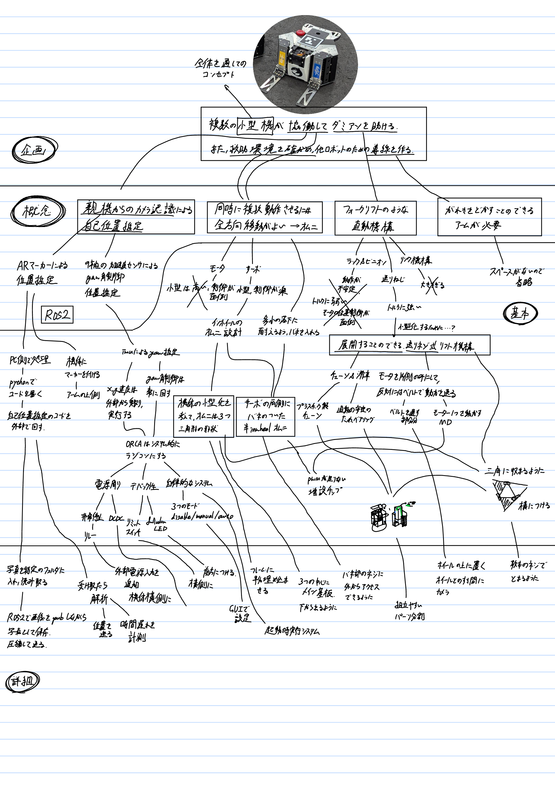

# **システムから作るロボット**
{: .no_toc }

## 目次
{: .no_toc .text-delta }

1. TOC
{:toc}

## "System"という視点
System、というのは工学にとどまらず、学問を学んでいるとよく出てくる、物の単位です。  
たとえば制御工学においては、制御対象を入力に対して特定の出力を返す数学モデルを内包したシステムとして捉えますし、生産システム工学では、都市や倉庫などをシステムとしてひとまとめに扱い、その中での人間や物品の動きを数式化したうえでその入出力関係を学問します。  
これはロボットを設計する時にも使うことができ、入力を人間からの操作入力、出力をロボットが動作した結果ととすれば、大きな視点でロボットを観ることが出来ます。  

## ロボット設計の起点
ロボットを作る際に重要な点として、そのロボットが何を目的にしているか、ということが挙げられます。  
目的のはっきりしないロボットでは適切な設計ができず、必要なセンサや機構が不足していたり、十分に役割を果たせなかったり、無駄な機能を載せすぎてしまったりします。  
そのためロボット設計は、システムズに表したときにその外側から決めていくことで、必要十分な機能を持つロボットを作ることができます。  
ただし、これにはロボットに対する知識が不可欠です。目的に対してどのような機構、回路、制御、ソフトを用意することが出来るのか、という経験を積んでいくと、こういった設計がしやすくなります。  
初めは大変かもしれませんが、目的をベースにロボットを作る練習をしておくことで同じロボット製作でも得られるものが違ってくるでしょう。

## 設計手順
設計プロセスとして、一般に次の4段階が挙げられます。場合によってはさらにその前段階に、企画という手順を含むこともあります。  
- 概念設計  
ロボットの大まかな仕組み、構造を決定します。  
このとき大事なのは、ロボットの目的をはっきりさせることです。
その目的を達成するためにどのような機構、制御が必要であるか考えましょう。
ロボットの内比較的目的が反映されやすい部分は機構や制御です。この段階で必要な機能を適切に絞れてしまうとよいでしょう。

- 基本設計  
形状、寸法、回路構造、制御構造、ソフトウェアに用いるプラットフォームなどを決定します。  
機構、回路、制御、ソフトを作り始めるうえでの雛形を完全に決定してしまいましょう。  
ここでロボットのうち目的を達成するために必要な部分をすべて書き出し、どう作るかまで決定してしまうとよいでしょう。
概念設計では機構や制御のみ扱いましたが、それらの目的を達成するためには動作させるための回路設計や、制御入力を受け取るためのソフトウェア設計が欠かせません。  
目的のために必要最低限の設計を考えるのが基本設計の段階です。

- 詳細設計  
形状、寸法、レイアウトを完全に決定します。  
ここではこれまで考えていなかった点について考慮しながら設計を進めていきましょう。  
メンテナンス性やでバック性能、組み立て分解のしやすさ、回路のledなど、あったらよいもの、なくても目的を達成するには支障のないものについて設計に取り入れていくのがこの段階です。
ここで機構だけでなく回路も含めてレイアウトした機械設計ができると、さらに洗練されたデザインになります。  

- 生産設計  
生産設備や納期を考慮した設計に変更します。  
ここまでするのは企業レベルの設計ですね。ただあえて挙げるならば同じパーツを複数作る必要がある場合、パーツの一体化や、刷りやすさをを考慮して形状を変化させる、加工時間を減らす、などが例としてあると思います。

## 機能分割
概念設計ができたところで、どのように次の設計に進んでいけばいいか困ると思います。ここで機能分割、という考え方を使って設計を進めていきましょう。  
やることは簡単です。目的をさらに分割していき、最終的に作らなければいけない細かい機能にまで分けていけばよいのです。今回はレスキュー部隊で作成したORCAを例に挙げてどのように機能分割をしていったのか説明します。  
  
機能分割を真剣に考えるのはかなり面倒だし、途中で詰まることもあると思います。しかし、紙の上でできるだけ設計を詰めることが出来るとロボット全体としてより良い設計につながるので頑張ってみましょう。   
ただ、個人的には紙の上で進められるのは基本設計までだと思います。これを超えると機構、回路、制御、ソフトのあらゆる点で予想外が起こります。実機を作りながらフィードバックし、設計を詰めていく。これが実際の詳細設計になっていくと思います。  
上の図では詳細設計はかなり少なく見えますが、実際にはこの何倍もの、図に表すのが大変なほどの回数の試行錯誤をこなすことによってロボットは完成形に近づいていくのです。

## 上流で設計する
上流、とは言葉のとおり、図でいうところの上側、つまり企画や概念設計です。一度詳細設計までの流れを済ませてしまうと、どのようなところに気を付けて設計しなければいけないかが分かるようになります。これを「制約」と呼びます。さらに今まで知らなかった技術や機能を知ることもできるでしょう。機構的、回路的、制御的、ソフト的な制約、そして可能性を取り入れて再度概念設計を行うと、前よりもより洗練された設計ができるようになるでしょう。このように下流で身に着けた技術や知識を上流の設計に反映していくことにより、より洗練された設計になるとともに、ロボット開発にかかる時間の短縮、ミスを減らせることによるコストの削減、より高度な(でバックやメンテ性)要求への対応が可能になるでしょう。

## 参考
- [初心者のためのロボット設計](https://qiita.com/imoni_soul/items/3bb80bf3a0d95604b7d5)  
業務でロボットやシステムを作る際の手順を説明してくれます
- 3年生の設計基礎工学の授業
- 3年生の人間機械システムの授業
