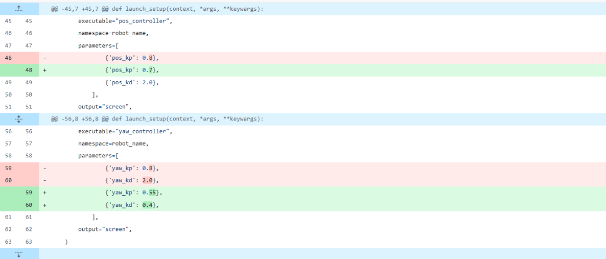

# **Git**
{: .no_toc }

## 目次
{: .no_toc .text-delta }

1. TOC
{:toc}

## Gitとは
一言でいえばバージョン管理ツールです。
よくアプリとかで見かける “v2.3” みたいなところを、
自分で管理できるイメージで大丈夫でしょう。  
実際に使うイメージでいうと、レポートを書いているときに、数時間前に誤って消した行を、
更新履歴を遡って取ってこれるというのが分かりやすい例です。  
バージョン管理とは、自分の進捗に名前を付けて保存することです。
この時保存されるのは保存したものそのものではなく、前回との差分となるので、全体としての保存量はファイルを丸ごと保存したものとあまり大差ないものになるでしょう。  
そのためGithubでの保存画面は次のように差分(足されたものと減らされたもの)のみが表示されるようになります。

## Gitによる開発の利点
誰が、何を変更したかが分かります。また、以前の変更に戻ることが出来ます。  
何かを変えたらなぜか動かなくなった、という経験はだれしもあると思いますが、この時に動いていたcommitまでもどればctrl+zを連打する必要もなくなります。  
また、下で説明しますが、branchというシステムを用いて進捗を分岐することが出来ます。これでファイルをコピーしてほかのコードを試していたらどれが動くものか忘れてしまった…といったトラブルが亡くなります。

## Gitを用いた共同開発

## branch

## conflict

## Gitのマナー

## GithubPages
このサイトはGithubPagesというシステムを使って作られています。