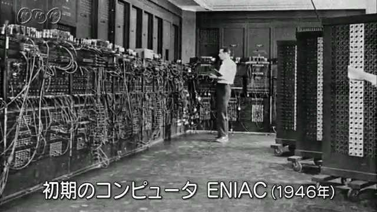

# **OSの歴史**
{: .no_toc }

## 目次
{: .no_toc .text-delta }

1. TOC
{:toc}

## 最初期のコンピュータ
最初期のコンピュータは演算装置(メインフレーム)のみでOSを持たず、パンチカードや磁気テープを読み込ませて動作させるのみでした。このコンピュータを動作させるためには物理的に配線を組み替える必要があり、現在プログラムを書くことをコーディングという所以となっています。  

## Operating Systemという概念
OSの最も基本的な役割として次のようなものが挙げられます。
- CPU管理  
CPUをどのジョブ、プロセスに割り当てるかを制御する。このシステムによりマルチタスクの処理が可能になる。
- メモリ管理  
各プログラムに必要なメモリ領域を割り当てる。メモリの上書きなどを避ける保護機能も存在する。
- ストレージ管理  
ファイルシステム。ディスクの空き容量、およびディレクトリの管理。
- 入出力
キーボードやディスプレイ。

## OS年表

## 参考サイト
[wiki](https://ja.wikipedia.org/wiki/%E3%82%AA%E3%83%9A%E3%83%AC%E3%83%BC%E3%83%86%E3%82%A3%E3%83%B3%E3%82%B0%E3%82%B7%E3%82%B9%E3%83%86%E3%83%A0%E3%81%AE%E6%AD%B4%E5%8F%B2)  
[OSの進化を時代に分けて表にしているサイト](https://www.choge-blog.com/history/ostimeline/#toc4)  
[もっと詳しくOSの歴史をまとめてるサイト](https://kogures.com/hitoshi/history/pc-os/index.html)  
[ファイルシステムについてさらっと解説](https://wa3.i-3-i.info/word13127.html)  

