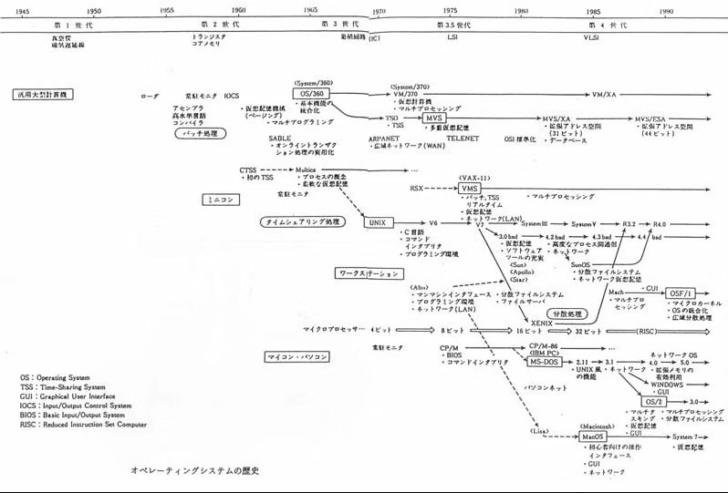

# **OSの歴史**
{: .no_toc }

## 目次
{: .no_toc .text-delta }

1. TOC
{:toc}

## 最初期のコンピュータ
最初期のコンピュータは演算装置(メインフレーム)のみでOSを持たず、パンチカードや磁気テープを読み込ませて動作させるのみでした。このコンピュータを動作させるためには物理的に配線を組み替える必要があり、現在プログラムを書くことをコーディングという所以となっています。  

## Operating Systemという概念
OSの最も基本的な役割として次のようなものが挙げられます。  
- ストレージ管理  
ファイルシステム。ディスクの空き容量、およびディレクトリの管理。
- CPU管理  
CPUをどのジョブ、プロセスに割り当てるかを制御する。このシステムによりマルチタスクの処理が可能になる。
- メモリ管理  
各プログラムに必要なメモリ領域を割り当てる。メモリの上書きなどを避ける保護機能も存在する。
- 入出力
キーボードやディスプレイ。  

これらをまとめると、OSの役割は  
データを管理する。  
ジョブを実行する。  
これらを人間に分かる形で表示する。  
となる。

## OS年表

1950年に世界最初の商用コンピュータが開発されました。しかし当時のメインフレームのみのコンピュータは用途に合わせて別々のものを用意する必要があり、売り手、買い手供に非常に面倒だったそうです。  
1964年にIBMがOS360を発表。これがOSの元祖と呼ばれています。特徴として、磁気ディスク装置を扱うこと、プログラマ用の部分と運用管理部を分割していることが挙げられ、OSはSystem/360アセンブリ言語で記述されていました。  
その後OS360はMVS(Multi Virtual Storage)という名前に進化を遂げます。このOSはメモリの任意の番地をスタート地点として扱うことができ、仮想的にメモリを分割してプログラムを実行することが出来ました。これまでのOSではジョブごとに物理的に分割されたメモリを割り当てて使うことが一般的であり、MVSで導入された仮想的にメモリを分割する方式(多重仮想記憶)によりコンピュータの性能は飛躍的に向上しました。  

1970年にAT&T社でUnixが開発されました。もともとMulticsという名前で様々な機能を搭載する予定だったものが、動作が遅かったため機能削減を図り改善され、Unixと呼ばれるようになりました。特徴として完全なマルチタスク機能を搭載し、ネットワーク、セキュリティーの面においても優れていることが挙げられます。のちに登場する様々なOSに影響を与えました。マルチタスク機能とは1つのコンピュータ上で複数のプロセスが同時動いているように見せる機能です。プロセスの動作をOS主導とし、一定時間ごとに  

## 参考サイト
[wiki](https://ja.wikipedia.org/wiki/%E3%82%AA%E3%83%9A%E3%83%AC%E3%83%BC%E3%83%86%E3%82%A3%E3%83%B3%E3%82%B0%E3%82%B7%E3%82%B9%E3%83%86%E3%83%A0%E3%81%AE%E6%AD%B4%E5%8F%B2)  
[OSの進化を時代に分けて表にしているサイト](https://www.choge-blog.com/history/ostimeline/#toc4)  
[もっと詳しくOSの歴史をまとめてるサイト](https://kogures.com/hitoshi/history/pc-os/index.html)  
[ファイルシステムについてさらっと解説](https://wa3.i-3-i.info/word13127.html)  

