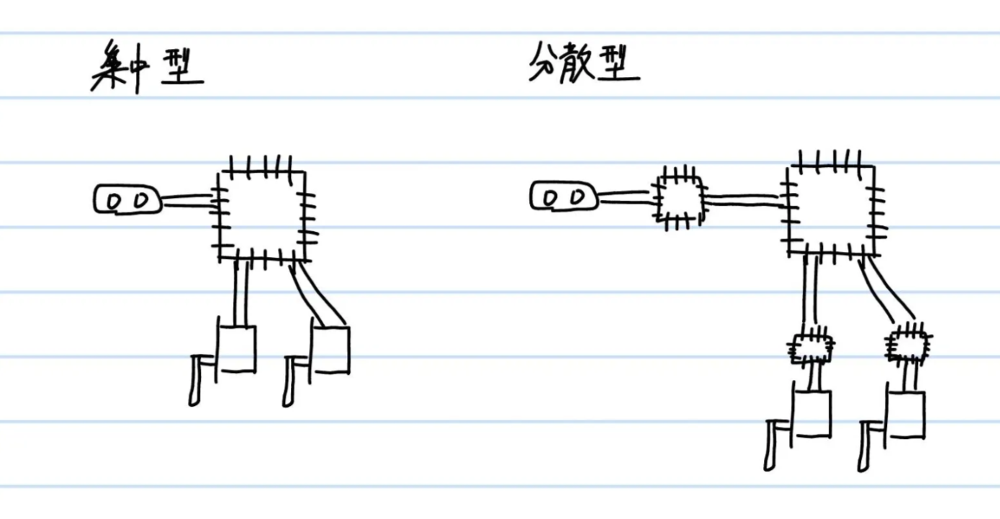
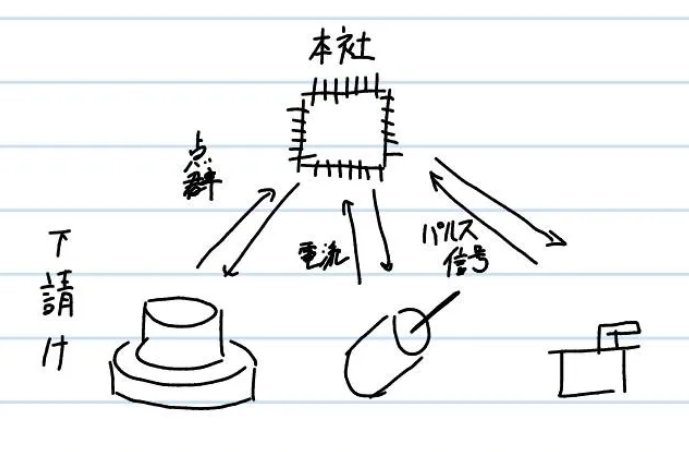
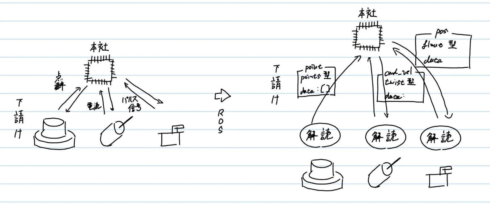
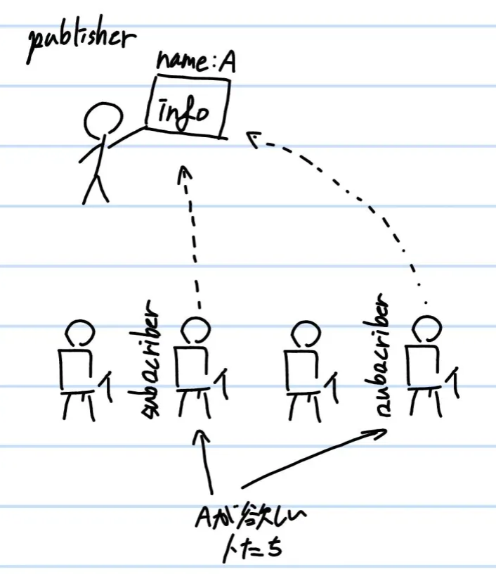
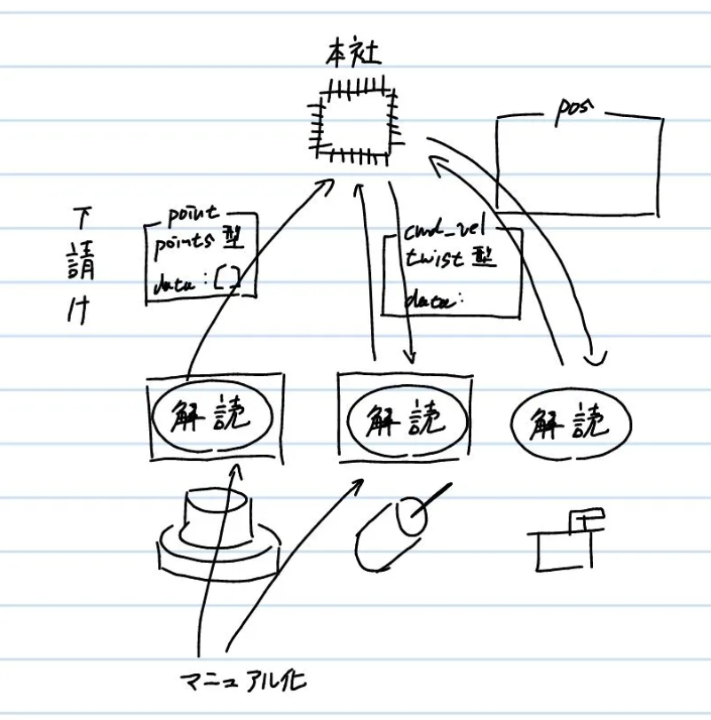

# **ROSとは**
{: .no_toc }

## 目次
{: .no_toc .text-delta }

1. TOC
{:toc}

## 集中型・分散型
システムを考えるにあたり、おもに2つの異なる方向性が考えられます。これが、集中型と分散型です。  
  
集中型システムとは、必要な機能を中心で一括管理し、制御することで、逆に分散型とは管理機能を分割し、それぞれの処理に対する負担を減らすシステムを指します。  
人間社会のシステムにも同じ考え方がありますね。  

さて、ロボットのシステムを考えるうえで、集中型システムは非常に扱いづらいシステムになります。  
処理をすべてメインのコンピュータでしなければいけないため、タスクが膨大になってしまう上、異なる通信方式によって動くセンサーやアクチュエータを一括に管理するのは大変すぎます。  
ロボットシステムを分散型にすることで、メインコンピュータの処理を減らすとともに、各小システムごとに動作をチェックすることができるようになり、開発もはかどります。  

簡単に言うと、下請けを作った、ということです。  
  

ここで問題になるのが、下請けとのコミュニケーションです。処理が楽になったからといって、複数の通信方式の異なるもの同士が会話をしなければいけない状況は変わっていません。  
この状況を解決してくれるのが、ROSなのです。

## ROSの役割
ROSの役割は下請けとやり取りをすることです。  
効率よく会話を進めるため、ROSは下請けとの間に共通言語を作りました。これが、topicです。  
  
topicというのはROSのシステムにおいてやり取りされる情報のことで、すべてのtopicは型と情報を持っており、名前が決まっています。  
ROSのシステムにおいて通信をするあらゆるプログラム、センサー、アクチュエータは、同じtopicという言語を使ってやり取りをしているのです。  

また、ROSのシステムではこのように分割された機能をそれぞれnodeと呼びます。ROSのシステムはnode同士の通信、という形で成り立っています。  

本社の仕事が複雑化すると、下請けだけではなく二次請けを作ったり、下請け同士ですり合わせをしてほしいことがあります。  
しかし本社としても仕事の進み具合は見なければいけないので、二次請けの仕事や下請け同士の会話も聞いておきたいわけです。  
そこで、ROSでは、publisher/subscriberという通信方式をとっています。会話を発する側は特定の名前のtopicを出します。そして、ROSの中のシステムたちは目的のtopicが出版(publish)されたらそれを読む(subscribe)のです。  
これにより、一対多の通信を、同じ言語ですることが出来るようになりました。  
  
図はflip形式で会話をするnodeたち

下請けとの会話が効率的に行えるようになったため、本社は様々なマニュアルを作ることにしました。  
気難しい下請け(扱いが難しいセンサー)と仲良くなる方法や、数を入れるだけで動いてくれるマクロつきexcelシートができていきました。  
これが、ROSにおけるライブラリです。
  
さらに、社員の仕事ぶりを監視するためのシステムまで構築され、仕事がどんどんはかどるようになったのです。  
これがROSにおけるrviz,rosbag,gazeboなどのnodeやtopicに対し様々な操作をすることができるツールです。

## ROSの特徴
まとめましょう。ROSは主に次の4つの特徴を持っています。  
- communication  
pub/sub通信を導入することにより、分散型コンピューティングシステムを容易に構築することができる。
- tools  
分散型システムに対して設定、起動、監視、デバック、可視化、ログ取得、テスト、停止など、様々な動作を行うツールと連携している。
- capabilities  
移動・マニピュレーション・知覚といった幅広い、ロボットに必要な機能を実装するためのライブラリがおおく存在する。  
- ecosystem  
大規模なコミュニティーにより、トラブルシューティングにたけている。

