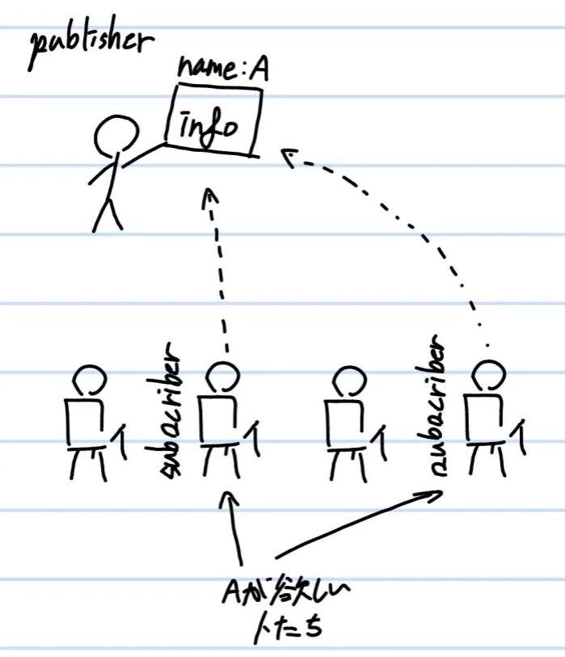
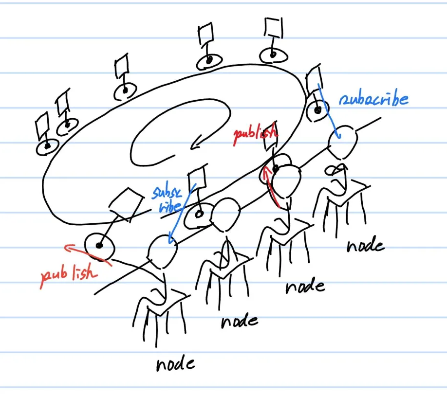
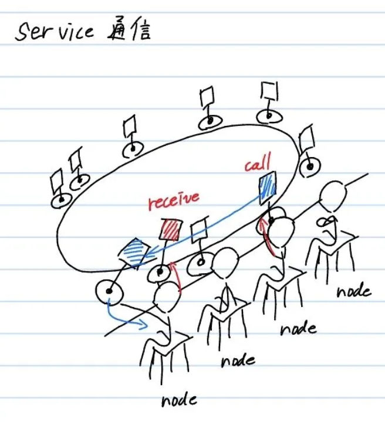
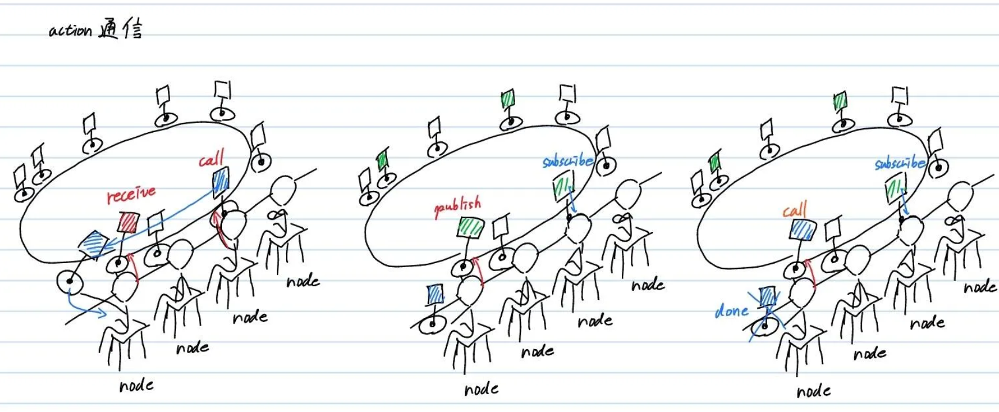

# **3種類の通信**
{: .no_toc }

## 目次
{: .no_toc .text-delta }

1. TOC
{:toc}

ROSの通信には主に3つの種類が存在します。基本的に使うのはpub/sub通信のみですが、場合によってほかの通信も有効であることがあるので、見ていきましょう。

## pub/sub
publisher, subscriberが存在する最も基本的な通信です。publisherであるnodeがtopicをpublish(出版)して、subscriberであるnodeがそれをsubscribe(購読)します。  
ここで重要なのが、おなじtopicにたいしてpublisherは一人でしかありえませんが、subscriberは何人でもよいということです。  
flip型の絵を使って説明しましょう。  
  

このようにpublisherが見せたtopicにたいし、その名前のtopicを欲しがっているsubscriberが読むという通信方式がpub/sub通信です。  

もう一つ重要なのが、どのnodeもpublisherとsubscriberに同時になり得るということです。  
回転寿司屋の絵を使って説明しましょう。  
この回転寿司屋は一般的なところと違って客がネタをレーンに載せることが出来ます。ただし客が載せるネタは、たまに流れてくる広告みたいなやつで、ほかの客が載せた広告を勝手にとることはしないとしましょう。  
  

このように、それぞれのnodeがpublisher,subscriberの性質を持ちながら互いに通信することが出来るのがROSのシステムです。

## service
service通信はpub/subと違い、特定の相手にのみ通信する方法です。  
serviceメッセージを送ることをcallと呼びます。  

service通信が特定の相手にのみ送られる仕組みは、受け手側にあります。serviceを出す側が受け手を決めるのではなく、受け手が目的のserviceを認識した時点でROSシステムからserviceが消えます。  
これにより、1対1通信を可能にしているのです。  

  

service通信の利点は、スタート信号など1度しか送る必要のない情報を効率的に送ることができる点です。さらに、serviceはreceive信号が出力されるまで一定期間、callし続けるような設定になっています。  
そのため、通信が一時的に遮断されていても接続するまで繰り返す、または接続していないことをチェックすることができます。  

## action
ROS2特有の通信方式です。  
実際にはaction通信という通信は存在せず、pub/subとserviceの組み合わせにより通信が行われています。   
  

action通信は主に3つの段階に分かれています。  

- 指令  
service通信により、指令が出されます。例えば、ロボットに特定の場所に移動するタスクを与える、などです。  
- 実行  
ロボットは指令を実行する間、一定期間ごとにtopicをpublishします。例えばゴールまであとどのくらいか、などを出力できます。  
- 完了  
タスクが完了するとロボットから司令を出した側にserviceがcallされます。これをもってタスクの終了報告とします。  

寿司屋の例でいえば、
- 寿司を十貫食べろとcallする
- 今何貫食べたかをpublishする
- 食べ終わったことをcallした  

となりますね。  

この通信は時間のかかるタスクに向いてます。action通信の他の利点は、タスクを途中で中止することができる、ということです。   

