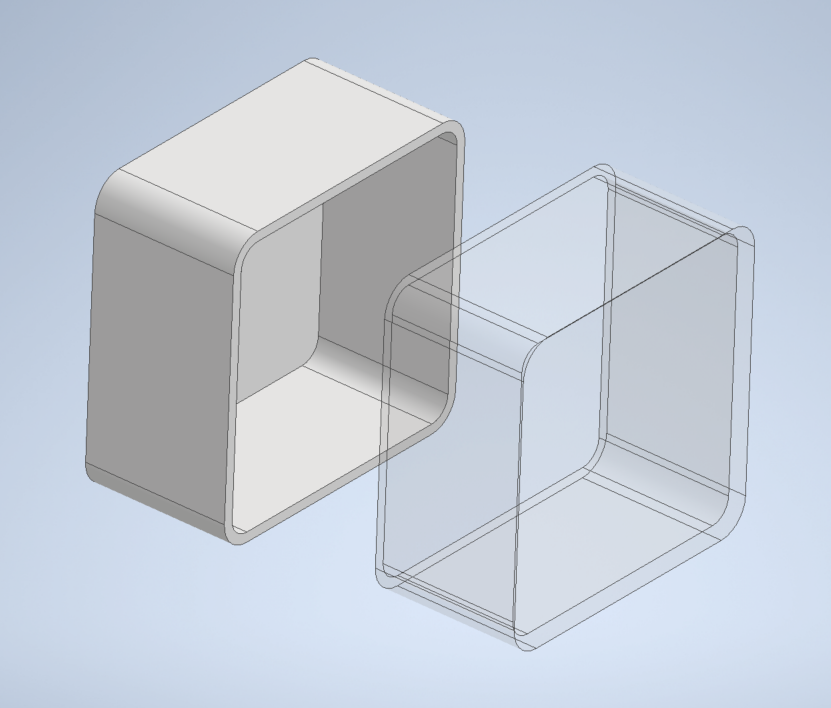
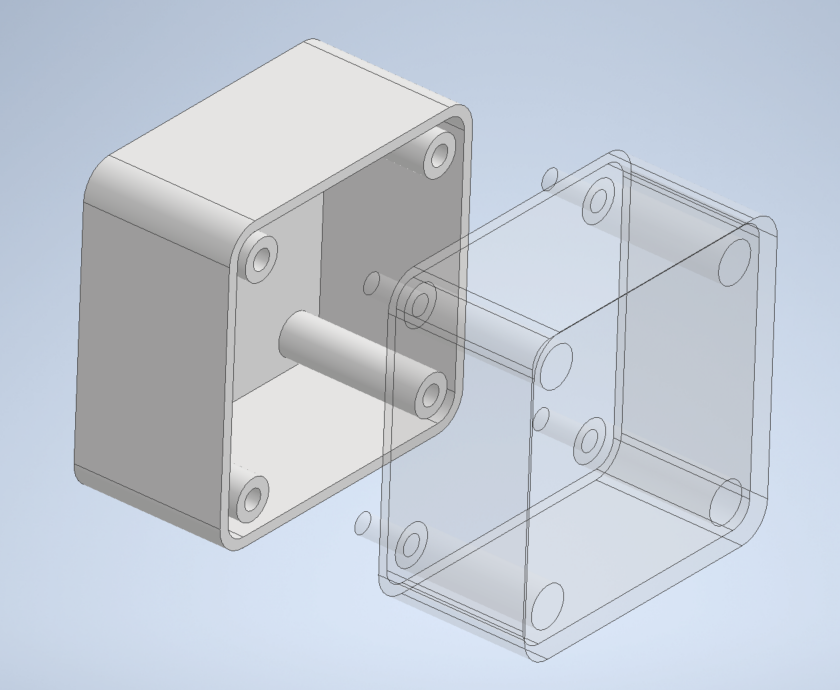
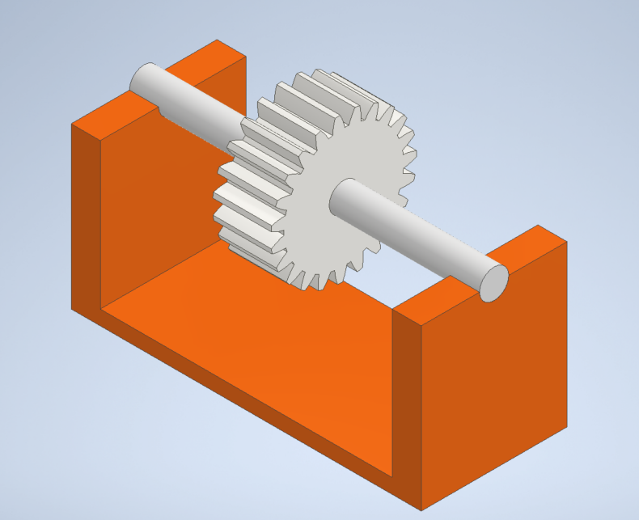
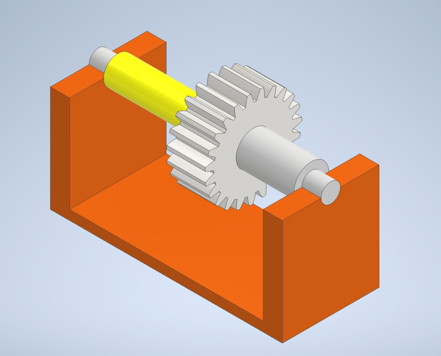
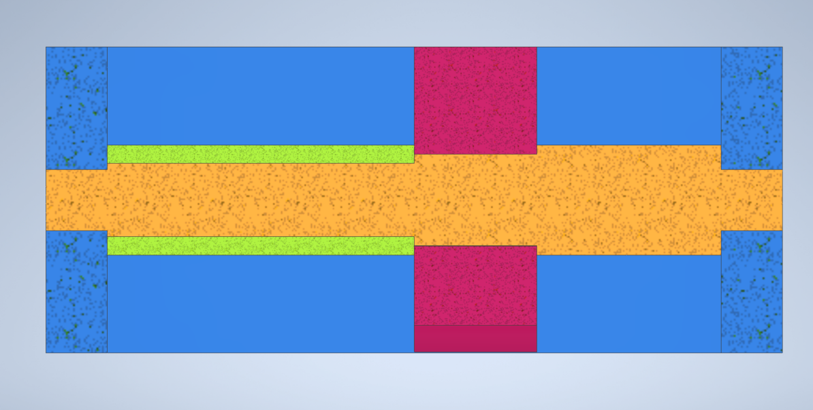

# 位置決め
{: .no_toc }

## 目次
{: .no_toc .text-delta }

1. TOC
{:toc}

# 位置決めとは
位置決めとは2つのパーツの位置関係を精度よく保つことです．物体には位置と姿勢で6つの自由度があります．この自由度すべてを完全に固定することで部品を固定します．固定の方法については[締結](../024_conclusion)で扱ったので，ここでは自由度を減らす位置決めについて話していきます．

# 位置決めの重要性
ロボコンにおいて位置決めを考えた設計をすることは，組み立てのしやすさとロボットの耐久性につながります．みなさんは自分あるいは先輩の設計したものを組み立てるときに，その組み立てずらさにストレスを感じたことはありませんか．プラモデルを作るときほどの気持ちよさは無いかと思います．これがプロとアマの設計です．プロの設計をすることはさすがに難しいですが参考になるものはたくさんあります．

プラモデル組み立ての楽しさの理由にはこの質の高い位置決めがあります．それでは次のような部品を接着剤を用いて固定するシチュエーションを考えてみましょう．これは位置決めが考えられていない設計です．面と面でしか合わせることができず，左右上下と回転など多くの自由度が固定できていません．部品の縁に接着剤をつけて固定しようとしてもズレてしまうことは目に見えていますよね．
 

ではプラモデルはどのようになっているのかを次の図で解説します．この場合はピンがはまることで部品の奥行方向の自由度以外がすべて固定されました．プラモデルには必ず凸と凹がパーツにあり，接着剤がなくともある程度固定できるようになっています．凸と凹の位置が正確にはまりあうことで組み立てやすく，組み立てに気持ちよさを感じるわけです．これが位置決めです．
 

# 軸の位置決め
回転部品には必ず軸があります．軸と回転部品の位置決めは最初に躓くポイントなので詳しく説明していきます．

軸に何か部品を通すとき，位置決めが考えられていない設計だと軸あるいは回転部品がすっぽ抜けてしまいます．下の図はなんの位置決めも考えられていない設計です．わかりにくいですが，軸径と台座の穴径，歯車の穴径がどれも等しく，軸方向へすべて抜けてしまいます．

それではどのようにしたらよいのか．軸の位置決めの場合，多くは軸径を変えます．位置決めが考えられた設計を次の図に示します．変わったところは軸の太さが場所によってことなること，黄色いパーツが1つ増えたことです．この黄色いパーツをスペーサーといいます．

より詳しく説明するために断面図を見てみましょう．断面図の橙色の部品が軸です．図を見てわかるように台座や歯車の位置に合わせて軸径が異なっています．これによって軸やパーツが抜けるといったことがなくなるのです．そして，この部品の自由度は上方向と回転のみとなりました．実際はここにキー溝やベアリングなんかが加わってくるためもう少し複雑になります．軸のこのような加工は一般的に旋盤を用いて加工されます．皆さん旋盤を使えるようになりましょう．

# 最後に
位置決めは奥が深いですが，知っておかないと組み立てをするときにとても苦労します．また固定がされていないためにすぐにバラバラになってしまうといったミスも起こりえます．設計をするときには必ずこの位置決めを考えた設計をしましょう．
