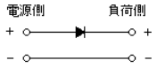
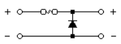
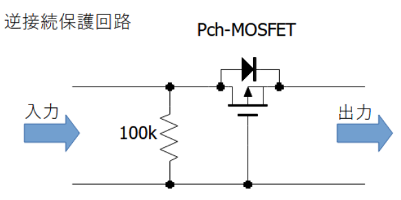
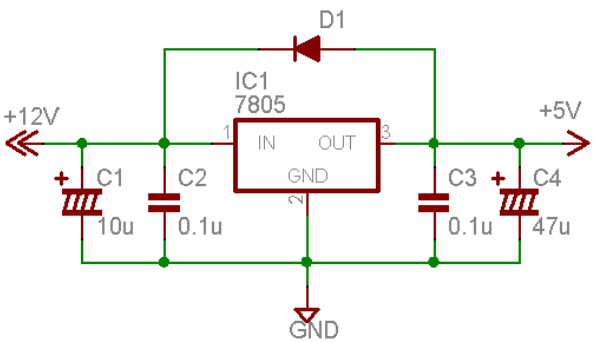

# **逆接**
{: .no_toc }

## 目次
{: .no_toc .text-delta }

1. TOC
{:toc}

## なぜ人は逆接をするのか
逆接は、してしまいます。これはもう、世の理だと思って諦めましょう。コネクタを作り間違えたり、コードの向きが逆だったり、安定化電源に刺す方向を間違えたり...道を誤る可能性はいくらでもあります。  
もちろん、しないように気を付けることは重要でしょう。しかしそれ以上に、もし逆接してしまっても回路が死なないようにしておくことが重要なのです。

## 気づき方
変な音がします。ledがしてはいけない光り方をします。例えば緑のledが橙色に光ったりします。基板のありえないところが熱くなります。  
ここまでならまだ間に合うかもしれません。基板が死んでいない可能性があります。しかし、これを超えると、、、  
パチッという音がします。光らないはずの素子が光ります。煙が出ます。変なにおいがします。火が出ます。  
こうなってしまうとさすがに死んでいます。

## 逆接防止回路
実は一度も成功したことがありません。だれかできたらお願いします。  
逆接防止はできるだけ電源に近いところにおいておく必要があります。

### ダイオード一個
  
一定の効果はあるでしょう。しかしダイオードの定格電流以上を流せなくなるという問題と、効率が落ちる、という問題と、ダイオードを電流が貫通することがある、という問題があります。

### ヒューズが切れる
  
こちらも一定の効果がありますが、ヒューズの選定を間違えると普通に回路が死にます。また、GNDが複数個所でつながっていた場合、このヒューズを避けて電流が流れてしまい、意味がありません。  
リセッタブルヒューズ(熱を発して一時的に回路を遮断するヒューズ)を使うのもいいかもしれません。

### MOSFET
  
PchMOSFETを使って負側に電圧化がかかった場合に回路を遮断する仕組みです。
おそらく最も効果的かつ一般的です。  
やったことがないのでどうなるのかはわかりません。  
PMOSを通常とは逆向きに付けて、逆接でない状態ではダイオードを電流が流れるようにしています。

## レギュレータの逆接状態
基本的にコンバータやレギュレータは、入力→出力の方向にしか電圧をかけることができません。ここで仮に基板の動作中に入力(電圧が高い方)が途切れたらどうなるでしょうか？  
出力先の回路には大抵、コンデンサかまたはそれに準ずる機能が含まれています。そのため入力が一気にGNDに落ちたとしても出力側はしばらくGNDよりも高い電圧を維持するのです。ここで、電流が高電位から低電位に流れることに注意すると、レギュレータの中を電流が逆流してしまう、ということに気づきます。  
一瞬ならば壊れることはないでしょう。しかし、電源を切るたびに何度もこれが繰り返されることでレギュレータは疲弊し、いつか壊れてしまいます。  
すると、降圧されていない電圧が直接マイコンに乗ってしまうため、マイコンも壊れてしまいます。  

では、どうやって防げばよいでしょうか？実はこれはかなり簡単で、出力→入力方向にダイオードをひとつ入れておけばよいのです。ダイオードは電流を流せる方向には抵抗が0になるので、出力の電圧が高くなったとしても電流はレギュレータではなくダイオードを流れてくれます。

  
