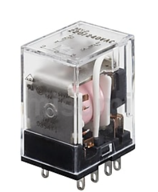
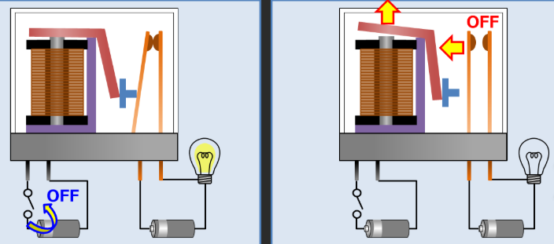
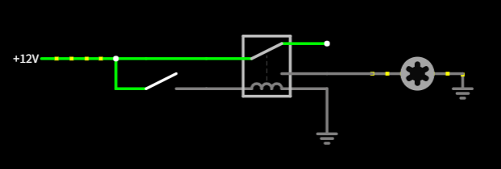
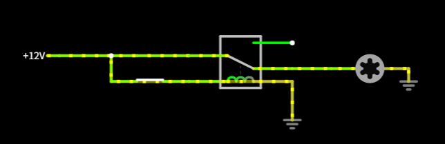
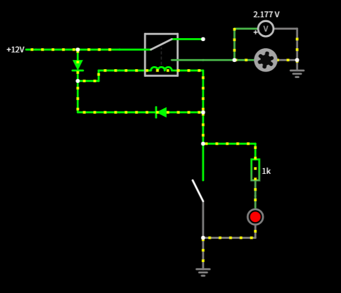
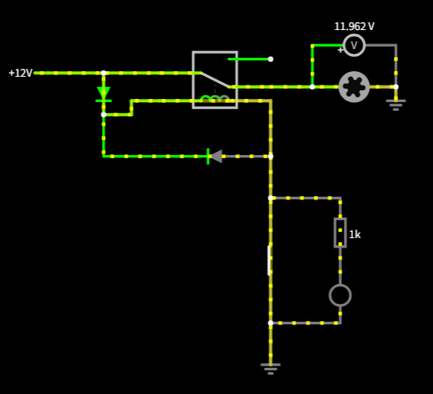
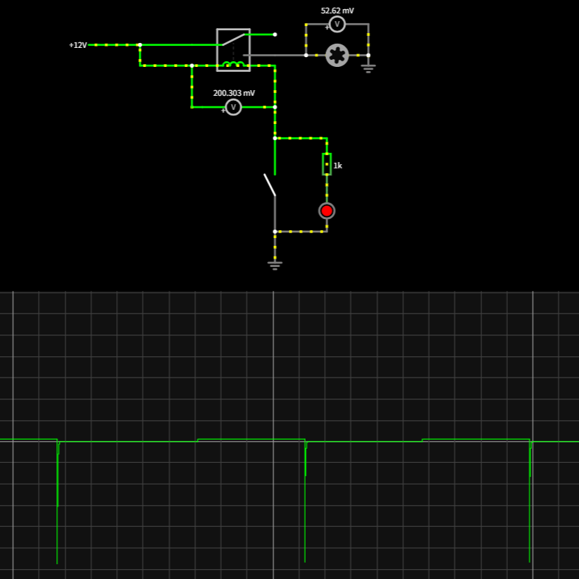
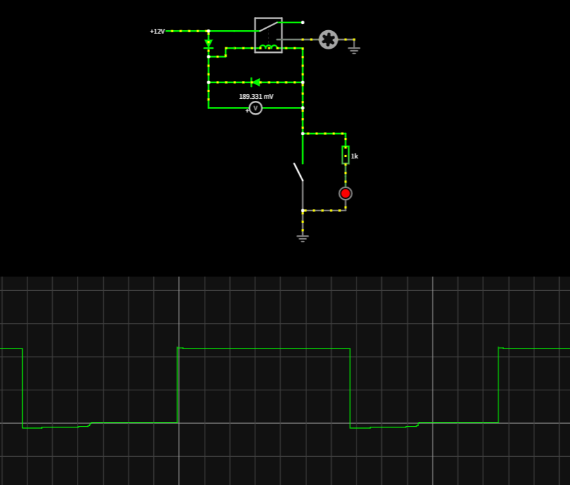
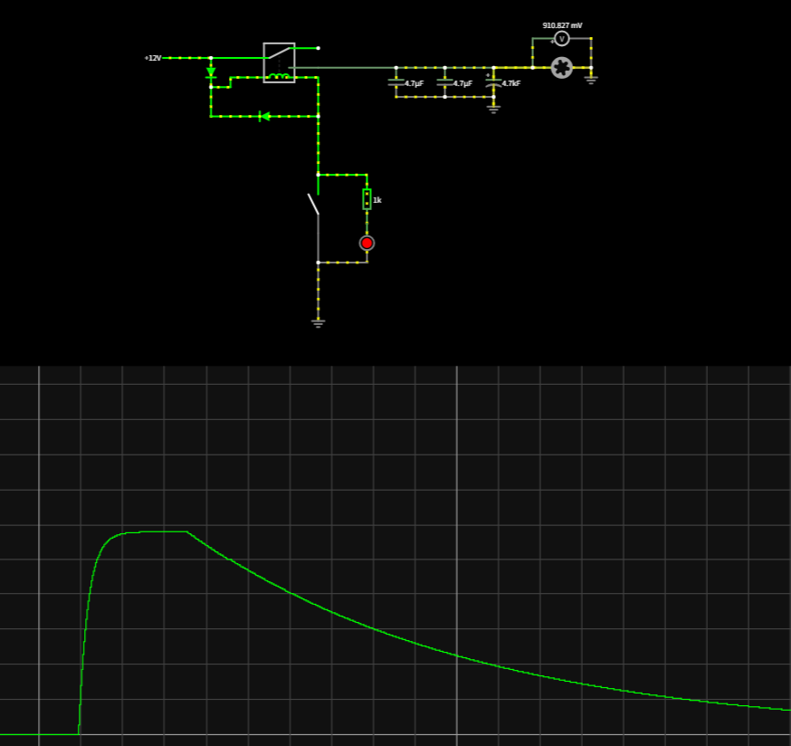

# **リレー**
{: .no_toc }

## 目次
{: .no_toc .text-delta }

1. TOC
{:toc}

[スイッチの章で使っている回路シミュレータ](https://www.falstad.com/circuit/circuitjs.html)

## NC,NO
それぞれnormaly closed, normaly open を意味します。  
通常状態で短絡されているか解放されているかを示し、機械的なスイッチにもこの考え方は存在します。  
外部から操作があった時のみ電流を切ってほしい場合にはNC、逆に外部からの操作がない限り切れていてほしい場合はNOのスイッチを使います。  
そのため緊急停止ではNOになるように回路を組んでリレーを用います。

## 仕組み
こんな見た目をしています。  
  
仕組みはいたって単純で、物理スイッチをコイルを用いて作動させています。  
コイルに電流が流れるとスイッチ部分が動かされ、出力のピンのどちらかに触れます。  
相ではないときはバネなどを用いて出力の一方にスイッチがこていされるようになっています。  
物理スイッチと動作が変わらないため、定格電流がかなり高くなっているのが利点として挙げられます。  
  

## 駆動方法
仕組みから分かるように、コイルに電流を流せば動きます。  

## 回路例
まず、最も簡単な動作を見てみましょう。  

このように、コイルに電圧をかけ、適切な電流が流れればスイッチが駆動します。ちなみにこのスイッチ回路は操作を加えないと動かないので、NOスイッチになります。  

さて、このスイッチでも十分動作は担保できるのですが、自由度が少ないという問題があります。そこで、出力側でon/offできるようにしましょう。  

電流が流れているのになぜリレーが駆動するかというと、リレーのコイル部分に流れる電流が減少したからです。適切な抵抗の値を選ぶことで電流を小さくすることができ、リレーの起動条件からはずれます。  
この回路により、電流を流す道を変えるだけでスイッチングすることができるようになりました。  
また、停止時にledが光るのもいい点ですね。  

しかし、まだ問題は残っています。コイルの逆起電力です。コイルのインピーダンスは電流の微分で求められますが、そのため急激な電流変化が起こると逆向きに電圧を発生してしまいます。  
  
上にちょっとだけ上がっているところが12Vです。これを見ると逆起電力がいかに大きいかが分かるとおもいます。

これは回路中の素子を壊す危険性があるため、ダイオードで対策をします。
  
これにより、逆起電力を吸収することが出来ます。  

最後に、出力を安定させるためにコンデンサを入れましょう。  
ですが、コンデンサを入れたことによりスイッチを切っても直後にモータを停止することができなくなってしまいました。  

そこで、コンデンサにたまった電荷を安全に放出できるような逃げ道を作ってあげましょう。  
といっていろいろ考えたんですが、うまくいかなかったので今回はここまで。  
うまくできたら追加します。あと、うまく作れた人はぜひ書き換えてください。  
