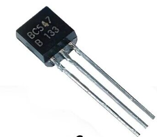
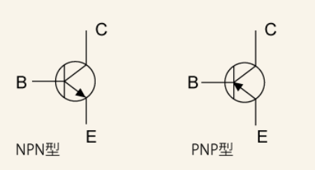
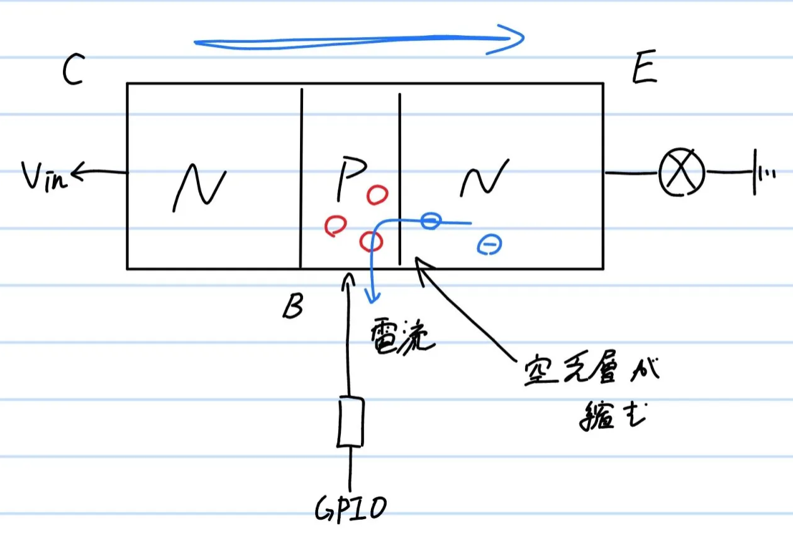
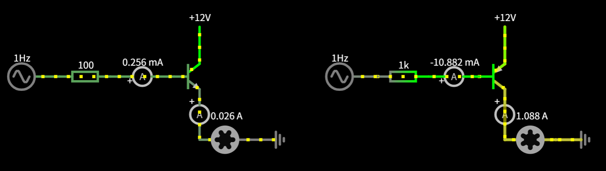
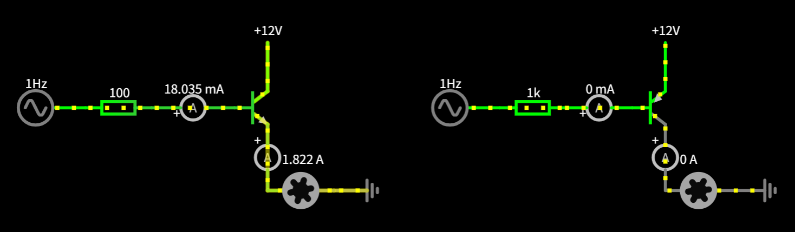

# **トランジスタ**
{: .no_toc }

## 目次
{: .no_toc .text-delta }

1. TOC
{:toc}

一般にトランジスタと呼ばれるものはBJT(Bipolar junction transistor)であり、小さい電流で大きな電流を制御するために用いられます。  
見た目はこういうやつです。  
  
また、回路図におけるシンボルは次のように書かれます。  

## 仕組み
トランジスタは、入力される電流に従って出力の電流を変化させる素子です。仕組みは水門のようになっており、かけられる電流によって水門の開き具合が変わります。これにより、小さな電流、電圧でより大きな電流の量をアナログに制御することが出来ます。  

トランジスタは半導体の組み合わせで、N型とP型の半導体を組み合わせて作られています。  
N型は電子が、P型は正孔が主なキャリアで、N型では電子が、P型では正孔が動きます。  
バイポーラトランジスタには一般に3つの端子があり、それぞれB(base),C(collector),E(emittor)と呼ばれています。  
トランジスタはベースがエミッタとコレクタに挟まれている構造をしており、ベースからエミッタに電流が流れるか、エミッタからベースに電流が流れ込むことで、流れている電流x増幅率だけの電流がコレクタ、エミッタ間を流れます。

### 空乏層
電界によってできてるらしいです。詳しくは知りません。書き足してください。  
要は、水門の門の部分です。これが縮まれば縮まった分だけ電流が流れます。

### NPN
ベース電圧がエミッタより高くなると駆動します。
  
ベース電圧が高くなると、P型のベースにキャリアが流れ込みます。すると、エミッタから電子がベースに流れ込んできます。  
これにより空乏層が縮み、コレクタ→エミッタに電流が流れるようになるのです。

### PNP
ベース電圧がエミッタより低くなると駆動します。  
あんまり使わないんで原理は省きますが、NPNの逆です。N型ベースに流入した電子がP型のエミッタの正孔に流れることで空乏層が縮み、電流がエミッタ→コレクタに流れます。

## 用途
主に増幅や減衰に用いられます。  
小さな電流で大きな電流を動かすことが出来ます。ロボコンにおいてトランジスタをそのまま使用する例はあまりありませんが、後で説明するMOSFETを駆動させるために用いるゲートドライバは、トランジスタで構成されています。
また、よく楽器のアンプなどに使われるオペアンプはトランジスタを複数組み合わせたものです。  

## オペアンプ
誰かお願いします。

## 回路例
まずは動作を見てみましょう。  
左側がNPNトランジスタ、右側がPNPです。
NPNではベースに交流電源(3.3V,オフセット3.3V)を接続し、12Vの直流電源でモータを駆動しています。  
PNPではベースに交流電源(12V,オフセット12V)を接続し、12Vの直流電源でモータを駆動しています。  
PNPを直接的に使いづらい理由は、このようにベース電圧がエミッタと同じかそれ以上にならないと出力を0にできないためなのです。  
[シミュレータ](https://www.falstad.com/circuit/circuitjs.html)
  
  
シミュレータのように、小さい電流(最大18mAほど)で大電流(最大1.8A)を制御することが出来ていると分かります。トランジスタの増幅率が100倍なので、動作は正しいですね。  
3.3Vというのは一般的なマイコンの出力電圧で、12Vはロボコンでよく使われる電源です。つまり、マイコンの電圧で、かつ定格電流を超えることなく、モータを動かすことが出来ているのです(ノイズなどの話はいったん置いておく)。

時間がないのでここまで。ここから先にいろんな回路図書いてください。
