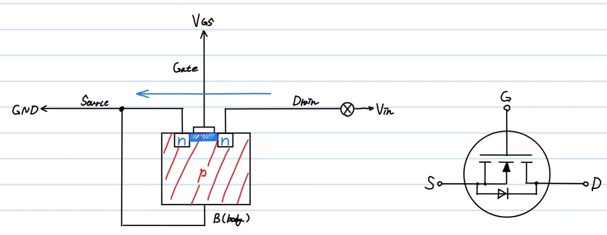
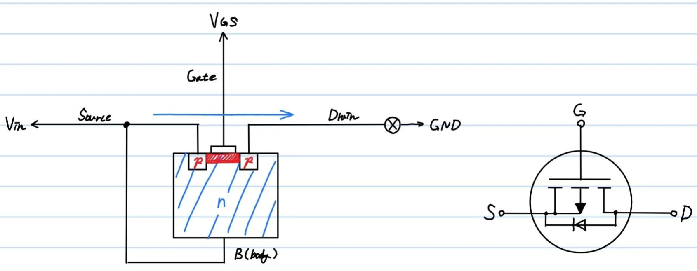
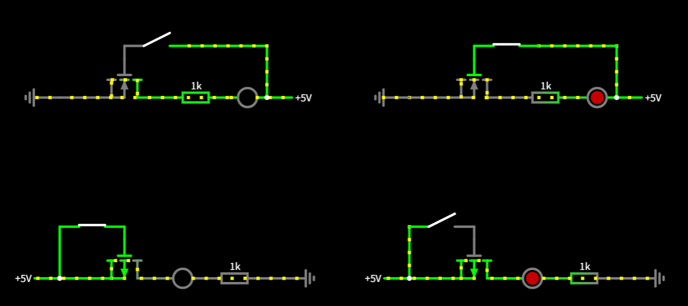

# **MOSFET**
{: .no_toc }

## 目次
{: .no_toc .text-delta }

1. TOC
{:toc}

## BJTとFETとMOSFET
FET(Field Effect Transistor)は、BJTの仲間です。一般にトランジスタとだけ言われたときはBJTを指し、こちらはフェットと呼ばれることが多いでしょう。  
最大の特徴は、BJTはベースに流れる電流で全体の電流を制御し増幅していた素子であるのに対し、FETはゲートにかける電圧でon/offを制御するスイッチング素子であるということです。  

MOSFET(Metal-Oxide-Semiconductor FET)は名前の通りFETの一種で、入力インピーダンスが高くスイッチングが早いという、マイコンから制御するのに適した特徴を持っています。  
入力インピーダンスが高いというのは駆動に必要な電流が小さいことを示し、そのためマイコンやその他の回路に及ぼす影響を小さくすることが出来るのです。  

## 仕組み
MOSFETはBJTと同じく3つの端子を持ち、それぞれG(gate),S(source),D(dorain)となっています。GがBJTでいうところのBにあたり、ゲートに電圧をかけることで動作を変化させます。  
BJTが空乏層を縮ませることで動作していたのに対し、MOSFETは電流が流れる道(=チャンネル)を作成することで動作します。(ただ、チャンネルはもともと空乏層だったらしいです。よくわかんないので飛ばします。)
チャンネルはゲート部分に作られる反転層であり、ゲートに電圧をかけることで電界が生まれ、橋が架かる、という理解で十分でしょう。  

MOSFETでは、SourceがBodyと接続されており、Bodyに対してGateが電界を生成します。そのため、Gate-Source間電圧が駆動において重要になります。  

### NchMOS
G-S間電圧が閾値を超えると駆動します。  
NchMOSFETは、ゲートに電圧を印可するとD->Sが導通します。  
  
Gate-Source間電圧が閾値を超えると、Bodyに対しGate部分の電圧が高くなります。これによりGateからBodyへの方向に電界ができ、正孔が遠ざけられ、反対に電子がゲートの方に引き寄せられます。これが、N型のチャンネルとなるため、NchMOSFETと呼ばれるのです。  

### PchMOS
G-S間電圧が閾値を下回ると駆動します。  
PchMOSFETは、ゲートに電圧を印可するとS->Dが遮断されます。  
  
動作はNchの反対です。Gate電圧がBodyに対して低くなることでBodyからGateに向けて電界が形成されます。これにより電子が離され、代わりに正孔が残ります。
ここで注意しなければいけないのはPchMOSをoffにするためにはSourceと同じかそれ以上の電圧をGateにかける必要がある、という点です。  

## 駆動方法
Gateに電圧を加えるような回路を組みましょう。  
MOSFET選定において重要なのは定格電圧、電流ですが、駆動回路の作成において重要なのはゲート電圧です。  
MOSFETの駆動に必要な閾値電圧をしっかり確認し、出せるようにしましょう。ただしPchの方はSourceに対してどれだけ低いとonになるか、という閾値であることを忘れないでください。  

### gate driver
適切にMOSFETを駆動させるためには、入力をそのまま用いるのではなく、適切な電圧・電流の値に変換してMOSFEに入れなければいけません。これをやってくれるのがゲートドライバ―です。  
まともに動かせたことがないので、これ以上言えることはありません。

## 用途
### ハイサイド/ローサイドスイッチ
ハイサイドスイッチとは負荷(モータなど)の上側につくスイッチのことで、ローサイドスイッチとは反対に負荷とGNDの間につくスイッチです。  
リファレンスとなる電圧にノイズが乗らないよう、ハイサイドの場合はPchを、ローサイドの場合はNchを使うのが一般的です。  

### 大電流、高速
MOSFETは主に2つの用途で使われます。MOSFETの特徴として大電流が流れ、スイッチングが早いということが挙げられます。  
まず大電流が流れる、ということは回路の根に近い部分にMOSFETを配置し、回路全体を遮断する役割に用いることができるということです。例えば緊急停止やバッテリー電圧と外部給電の切り替えなどに用いることもあります。  
続いてスイッチングが高速である、ということは高速な信号を用いる回路に使えるということです。MDなどに使われるそうです。これは、よく知りません。

## 回路例
まずは動作を確認しましょう。上がNch、下がPchです。    
  

## MOSFETの回路設計
これが、難しいらしいんですよ。知らない。
