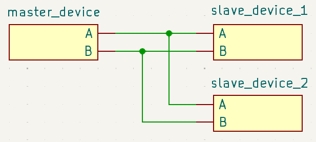

# **様々な通信**
{: .no_toc }

## 目次
{: .no_toc .text-delta }

1. TOC
{:toc}

## OSI参照モデル
Open System Interconnection Reference Model  
通信を7つの階層に分割する考え方を指します。これにより通信の保守性が上がり、また規格を一般化することが出来ました。この企画はISOが提唱しているものです。  
まずはこれらの階層を説明します。  

|レイヤ|階層名|役割|
|---|---|---|
|L1|物理層|ビットを物理信号に変換|
|L2|データリンク層|MACアドレスなどを用い、同一ネットワーク上でフレーム通信を行う|
|L3|ネットワーク層|IPアドレスに基づき、異なるネットワーク上でパケットを転送|
|L4|トランスポート層|end to endの信頼性(順序、再送)|
|L5|セッション層|通信の開始、維持、終了、再開|
|L6|プレゼンテーション層|データの表現形式(暗号、圧縮、文字コード)|
|L7|アプリケーション層|アプリケーションとネットワークの接続|

一般にひとつの機械システムの中で使われる通信システムは、このうちレイヤー2までを含んでいます。  
つまり、  
物理層=通信線の数や電圧、データリンク層=アドレスの指定方法や誤り検出  
となっているということです。  
これより上のレイヤ―については[象-software](../../../005_software/index)で扱う、無線通信を見てください。

## デジタル信号
物理世界はアナログです。あらゆる現象、信号などは無限大の分解能をもっています。それに対し、機械はデジタルの信号のみを扱っています。デジタルの世界では小数点以下の数値は浮動小数点、という01の羅列で表現され、分解能が有限の値なのです。  
そして、電気回路で大事になるのはいかにしてデジタル値でアナログ値を表現するか、ということです。

### GPIO
主にデジタル信号を送受信するのはマイコンです。マイコンには主に電源とGPIO(general purpose input output)と呼ばれるピンがあり、これらのピンから任意の信号を出力することができます。  
出力できる信号は基本的には2種類で、HIGHとLOWです。LOWはマイコンのGNDと同じレベルにピンの電圧を落とすこと、HIGHは逆にマイコンでHIGHとされる電圧までピンを引き上げることです。大抵このHIGHは3.3Vになっています。Arduinoなど5Vのものもあります。

### 信号の受信
GPIOによるHIGH/LOW信号の受け取り方は主に2種類あります。
- ボーリング  
時間ごとにピンの信号を読み取り、動作を変更する受信方法。状態としてHIGH/LOWが存在する時に有効。
- 割り込み
ピンがHIGH/LOWに変化した場合に動作を行う受信方法。信号の変化に対して即座に動作ができる。高い反応性が必要な場合や、リミットスイッチなど一度しか動作しないものを読み取る場合に有効。

### PWM
マイコンがアナログ信号をデジタルとして送る方法はいくつかありますが、その中でもっとも単純なのがPWM(pulse width modulation)信号です。日本語ではパルス幅変調といいます。  
原理は単純で、アナログの値をHIGHとLOWの割合で示したものです。サーボモータの角度(速度)指定などによく用いられ、大抵50Hzか60Hzで動作しています。信号の1周期の中にHIGHの時間が何割含まれているかを送信するものです。  
精度はあまりよくなく、とりあえず動けばいいところに用いる印象です。あと、配線も複雑になってしまいます。利点としてはPWM信号で動くアクチュエータは安価であるということが挙げられます。

## シリアル通信
シリアル通信とは、通信を1本の線で行う方法です。対義語はパラレル通信と呼ばれ、こちらは複数の信号線を用いて同時にデータ通信を行いますが、現在はほとんどがシリアル通信となっています。  
シリアル通信の利点は、データ信号のずれが少ないことです。これにより、通信速度を速めることが出来ます。  
またシリアル・パラレルに限らず互いに通信することができる通信方式をマスタースレーブ通信と呼び、どちらかがメインとなり通信をはじめ、スレーブは通信を受け取り、返信をします。  
パラレル通信では各通信線に意味を持たせて情報を送ればよかったのですが、シリアル通信の場合は情報を送る順番や送るタイミングで01の情報に意味を付与しなければいけません。どのようなデバイス間でも通信ができるように定義されたのが、これから説明する通信規格なのです。

### デイジーチェーン  
シリアルデバイスを複数つなげることをデイジーチェーンと呼びます。  
これにより、マスターのデバイスから大量の配線を生やすことなくデバイスを動作させることが可能になるとともに、回路やプログラムのコードの簡略化、エラーの防止につながります。  
デイジーチェーンなど、ひとつのmasterに対し複数のslaveを接続する構成をマルチドロップ方式と呼びます。

### TTLレベル(Transistor-Transistor Logic)  
トランジスタの動作に合わせてHigh Lowと認識される電圧値を規格化したものです。

|電圧|値|
|---|---|
|Hiレベル入力|2.0V以上|
|Loレベル入力|0.8V以下|
|Hiレベル出力|2.4V以上|
|Loレベル出力|0.4V以下|  

通常シリアル通信はこのTTLレベルに従って動作します。espやraspberrypi含めほとんどのマイコンや、通信を行う様々なチップはTTLレベルに従って通信を行います。これらの電源レベルは3.3Vが一般的だとされています。  
以前は5Vが主流であり、arduinoやKondoなどのシリアルサーボは5Vで通信されます。　　
また近年さらに通信は定電圧化し、1.8V,0.9Vなどが使われることも増えています。(PCのマウスのセンサーは1.8V)  

## 非同期式シリアル通信
### UART
Universal Asynchronous Receiver / Transmitter  
汎用非同期式送受信機。  
clockを合わせる代わりに通信のはじめと最後を示すbitを用い、通信速度を同期することにより信頼性を高めています。  
UARTとは、パラレル信号をシリアル信号に変換する規格、部品全般を指します。一般に、マイコンやPCは大量のデータを扱っているため、内部の情報伝達はパラレル方式で行っています。これを外部に出力するためにUARTが用いられるのです。  

物理層  

|信号線|接続先|役割|
|---|---|---|
|TX(transmit exchange)|RX|自分から相手へ送信(transmit)|
|RX(receive exchange)|TX|自分が相手から受信(receive)|  

  

1対1通信です。  
clock信号を用いないためノイズに弱いという問題があります。しかし基本的にUARTのみで通信をするのは基板の上の短い区間か、市販の信頼性の高いケーブルを通じてのみになるので問題はないでしょう。  
マイコンが何かとシリアル通信する、というときに"シリアル"と言われるのが大抵このUARTです。

### RS-485
Recomended Standard -485  
EIAによる国際規格です。RSと名前が付いた通信でほかに有名なものは、  

|規格名|用途|
|---|---|
|RS-232|古いPCのCOMポート、医療機器。1対1通信|
|RS-422|RS-485の簡略版。船舶や航空機のシリアルに使われる。|  

などがあります。  
RS-485はここで紹介されている他の通信とは異なり物理層までの規格しか存在せず、物理層にRS-485を用いた様々な通信規格が存在します。([制御における通信](../../../004_control/contents/100_implementation/001_communication/index)参照)  

- 半二重、全二重  
I2Cのように情報の入出力で共通の通信線を用いるものを半二重通信、SPIのように別の線を用いて通信を行うものを全二重通信と呼びます。  
- one-wire  
通常、RS-485はひとつの通信に対して2本の線が用いられますが、これを1本で行っているものを俗称としてone-wire通信と呼びます。どちらかと言えばあとで説明するTTL通信に近いですが、HRで使うKondoはICS通信においこの規格を使っています。

物理層  
半二重通信の場合(one-wireではない)

|信号線|接続先|役割|
|---|---|---|
|A|A|通信線の片方|
|B|B|通信線のもう片方|

UART同様非同期式通信方式を用いています。  
RS-485通信ではデータリンク層でslaveのidを指定することで複数のslaveと同時に通信することができます。標準で最大32機との同時通信が可能であり、ほかの通信方式と比べても同時接続の個数が多いです。  
サーボモータやセンサーなど、大量の同型slaveを制御する時などの用いられます。  
また、実際にマイコンからRS-485方式に則って通信を行う際は、UARTシリアルで信号が出され、それをRS-485に変換するようにチップを入れることが多いです。

### CAN
Controller Arear Network  

物理層はRS-485に近いけれど、プロトコル部分が全く違うそうです。  
触ったことないから説明できないので飛ばします。  
RS-485同様、様々なセンサ、IoTに使われる他、マイコン同士の通信などにもよく使われます。

### USB通信
USBはめちゃくちゃ複雑なプロトコルで動作していますが、そこをいじることはほとんどありません。  
D+、D-で動作する差動通信、とだけ考えておけば十分だと思います。  
雰囲気としてはRS-485とほぼ同じです。  
残り、書ける人お願いします。

## 同期式シリアル通信
### I2C
Inter-Integrated Circuit  

物理層  

|信号線|接続先|役割|
|---|---|---|
|SDA(Serial Data)|SDA|データ線|
|SCL(Serial Clock)|SCL|Masterが生成するClock信号|

  

同期式と異なり、通信はSDCのClock信号に従って行われます。このような通信を同期通信と呼びます。  
SDAにデータを流す際にデバイスのidから始めることで通信相手を選択しています。  
大量のslaveとある程度高速に通信することが出来るため、使いやすいです。  
主にセンサーや、ledコントローラーなど多少複雑な動作をするチップに使われることが多いです。  
デイジーチェーンで使うことが出来ますが、あまりやらないイメージです。

### SPI
Serial Peripheral Interface  

物理層  

|信号線|接続先|役割|
|---|---|---|
|MOSI(Master Out Slave In)|SDI(slave data in)|master -> slave 方向の通信|
|MISO(Master In Slave Out)|SDO(slave data out)|slave -> master 方向の通信|
|SCLK(Serial Clock)|SCLK|Masterが生成するclock信号|
|SS(Slave Select)|SS|slaveのデバイスを選択|

SSはCS(Chip Select)と呼ばれることもあります。

  

I2C同様マスターが発するclock信号に従って通信が行われます。  
1度に1つのslaveとのみ通信が可能で、対象のslaveにつながれたSS信号をlowにすることで通信対象を選択します。
このような動作方法を"active low"と呼びます。  
大量のslaveと通信するためには向いていませんが、入出力が別の線で駆動されるため小数のslaveと高速で通信を行う場合に適しているとされています。  
I2Cと比べデータの入出力が別の線になっており、またアドレス指定が必要ないため高速に通信が可能です。
基本的に1対1で少数の高速通信が必要なセンサや、SDカードなどと通信する場合に用いられています。  

頑張ればデイジーチェーンのようにして使うこともできるらしいです。
