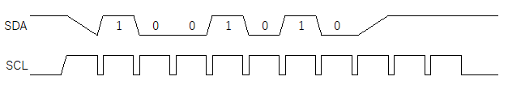

# **動作原理**
{: .no_toc }

## 目次
{: .no_toc .text-delta }

1. TOC
{:toc}

通信方式を決めるにあたり、動作原理を知っておくことは重要です。  
しかし、実は通信方式を自分で決める場面はほとんどありません。というのも世の中にある大抵のデバイスは通信方式があらかじめ決まっており、マイコンボードを作るときに対象のデバイスと通信できるような回路を組めばよいだけだからです。しかし、仮に自分で選定する機会がなかったとしても、各通信方式について知っておくことで回路や制御の理解が深まります。  
ここでは[様々な通信](./005_communication)で説明した通信方式について、動作原理とその特徴について掘り下げて見ていきたいと思います。

## PWM

## 非同期シリアル
### UART
TX,RXそれぞれにHighまたはLow信号が周期に従ってかかるだけです。

### RS-485

### CAN
分かりません。

## 同期シリアル
### I2C
  

clock信号がHighのときのData信号を読み取ります。  
信号線のHighレベルを1として認識します。  
認識にはTTLが使われます。  

### SPI
SPIには4つのモードが存在します。  
まず、ClockのアイドリングがHighかLowかで2種類、そしてそれぞれに対し立下りor立ち上がりを信号のサンプリングにする場合で2種類ずつ存在します。  

モードの図を入れる  

ここではclockのアイドリングがLowで、立下り時にサンプリングする状態に
