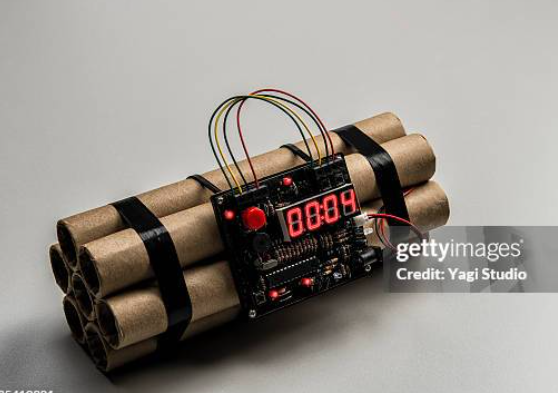
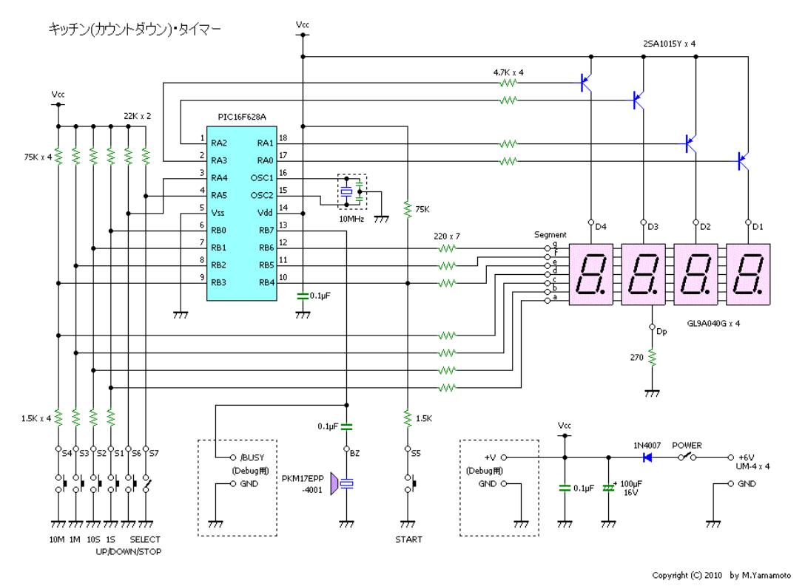

# **配線・回路**
{: .no_toc }

## 目次
{: .no_toc .text-delta }

1. TOC
{:toc}

## 基板上の配線
### 角度
基板において配線を直角にすることは望ましくありません、というのも角で電流の反射が起こるからです。  
配線パターンは直角になることを避け、45度ずつ曲げることでノイズを抑制することができます。
### ビア
基板上に通信線を引くとき、基本的には片面のみで引くことが望ましいです。というのも、ビアを使うことによりその部分の配線を直角にしてしまうからです。
### GNDガード
信号線の周りをGNDパターンで囲うことを言います。ケーブルでもシールドと言って外側をGNDで囲む場合がありますが、これと同じです。信号線のノイズを外部に漏らさないとともに、外部からのノイズを遮断することができます。  
このとき、GNDガードは一定以上の太さがあり、また十分に狭い間隔(10~20mm)でビアが空いているとよいです。  

## コードによる配線
基板同士、基板とアクチュエータとの通信にではコードを用います。typeCのコードなども、同じことです。  
接続端子については[コネクタ](../035_connector/index)の章を見てください。  
配線の色は基本的に自由ですが、ある程度規定があり、これに沿わないと見た感じでどれか分からなくなります。
ただ、どの通信でも、というか回路システム全体において共通されるのが、"Vcc=赤、GND=黒"です。  

また、コネクタにおいて何番が何の線になるか、というのも重要です。

### PWM

|番号|名前|色|
|---|---|---|
|1|GND|黒|
|2|Vcc|赤|
|3|PWM|黄|

1番がGNDになるイメージが強いです。  
上の例はsg90の配色ですが、PWMの通信線には黄色、橙など暖色系の線か、白が使われるイメージがあります。

### GROVE規格

|番号|名前|色|
|---|---|---|
|1|TTL通信|黄|
|2|TTL通信|白|
|3|Vcc|赤|
|4|GND|黒|

GROVEは4線の通信を同一規格で扱うことを目的としています。3線のみ使う場合は、2番ピンを使わずに通信します。  

- UART  
1: RX、2: TX
- RS-485  
1: A, 2: B
- I2C  
1: SCL, 2: SDA

### XH規格
XHコネクタを使う場合、こうなっているようです。

- UART  

|番号|名前|色|
|---|---|---|
|1|Vcc|赤|
|2|TX|黄|
|3|RX|白|
|4|GND|黒|

- I2C  

|番号|名前|色|
|---|---|---|
|1|VCC|赤|
|2|GND|黒|
|3|SCL|黄|
|4|SDA|白|

### その他
- DYNAMICELサーボ
Vcc,GND,通信線の3本で、赤、黒、白です。全て黒のバージョンもあります。  

- KONDOサーボ
同じく3本線で、全て黒です。GNDのみ灰色のバージョンもあります。

### SPI通信

|番号|名前|色|
|---|---|---|
|1|VCC|赤|
|2|GND|黒|
|3|SCLK|青|
|4|MISO|白|
|5|MOSI|黄|
|6|CS|緑|

SPI通信に特化したコードを販売しているところは見つけられませんでしたが、Adafruitの配線例から順番だけは取ってきました。Adafruitではいつもこの順番で基板を出しているので、これに従っておけば問題はないと思います。  
配線の色はまちまちだったので、SCLK以降は私が考えたものを書きました。使えそうな規格を見つけたら書き換えておいてください。

### 雑談: 時限爆弾のコードについて
  
昔のドラマとかで、爆弾処理をするときに赤か黒かどっちを切るか迷うシーン、あるじゃないですか。緊迫感あっていいんですけど、いつもあれを見ながら全部同じ色にしといたら解除されることもないのになー、なんて思ってたんです。でも、自分でロボットを作ってみて絶対ダメだということに気づきました。どれがどれだかわかんなくなるんですね、配線。色分けしてても分かんなくなります。通信線はまぁ最悪間違えても被害が少ないんでいいんですけど、爆弾で間違えたら一大事です。死んじゃいますからね。だから、爆弾魔はカラフルな配線使うのかなーと納得しました。  

もう一つ気になったのが、なんで赤or黒かっていうことです。この謎を解明するために、爆弾がどういう構成になってるかを考えてみたいと思います。  
まず、タイマーが必要ですね。ドラマだからだと思いますが、市販のタイマーっぽいのが括り付けられています。  
次に、着火装置が必要ですね。仕組みは知りませんが、電気的に着火させられる装置はいろいろあるでしょう。  
あとは爆弾本体だけ用意すれば時限爆弾が作れます。  
次に考えなければいけないのが、動作の完全性です。  
時限爆弾の目的は爆発することなので、勝手に解除されては困ります。いじると爆発するようにしておきましょう。  
まず、着火装置部分ですね。ここを外されると終わりなので、着火装置が爆弾に接続された状態で電流が流れるようにしておき、外すと爆発するようにしましょう。
あぁ、着火装置への電流が切られても困りますね。着火動作をする部分を丸ごと触れないように隠し、配線が切られた瞬間爆発するようにしましょう。  
次に電源です。電源を切られたら動かなくなる、なんてもってのほかです。先ほどの着火装置を動作のメイン部分として、予備電源のコンデンサを付けておきましょう。着火をそもそもコンデンサで行うようにしておけば、電源が遮断された瞬間に爆発する仕組みを作ることが出来ます。usp(無停電化)ですね。  
最後にタイマーです。これが一番重要でしょう。タイマーを切り離された瞬間に止まるような爆弾では困ります。
仮に市販のタイマーを使ったとすると、ブザーにつながっている部分をつなぎかえれば立派な起爆装置に生まれ変わります。  
ここで、[キッチンタイマーを自作した記事](https://xyama.sakura.ne.jp/hp/KitchenTimer.html)を見つけたので見てみましょう。  
  
このタイマーはピックマイコンを使ってタイマー動作を再現してるみたいです。ピックマイコンのclock割り込みを使い、内部処理でタイマーを作っています。  
タイマーに何かされたときにすぐに爆発するようにするには、タイマースタートと同時に起爆信号をHIGHにして、LOWになったら爆発するようにすればいいのです。  

これらの対策を講じることにより、起爆装置を抜く、起爆装置への信号線を切る、タイマーを外す、タイマーの電源を落とす、といった解除方ほをすべて封じることが出来ました。  

さて、ここでドラマの描写を思い出してみましょう。ニッパーでパチッと爆弾の線切る緊張の瞬間。目を開けた主人公の前には、残り1秒で止まっているタイマーがあります。あぁよかった...ではなく、ここで注目してほしいのがタイマーが止まっているということなのです。つまり、ドラマにおける爆弾処理とは、タイマー自体の動作を止めることにより停止信号をタイマーから出させないようにすることだったのではないでしょうか？  
先ほどのタイマー回路を思い出してください。この回路においてタイマーが進行するのは、水晶振動子によってclock信号が入力されているからです。つまり、タイマーの駆動源である水晶振動子をマイコンから切り離すことが出来れば、ドラマと同じような爆弾処理をすることが出来るのです。  

では初めの問いに戻りましょう。赤or黒の配線はこの回路のどこに当たるべきでしょうか？赤黒の線がセオリー通りVccとGNDに割り当てられているとして、爆弾処理班が有能で、マイコンの電源など切ってはいけない線が除かれているとしましょう。他にGNDはないかなーと探してみると...ありました、水晶振動子のGNDが。普通こういうことはしませんが、仮に水晶振動子からマイコンと別でGNDが生えているとすれば辻褄はあいます。ではVccはどれかというと、タイマーの電源ではないでしょうか？  

以上より、私の中では次の結論に至りました。  
- ドラマの爆弾魔はタイマーを作る際、外部クロックで律儀に時間を測っている。  
- 爆弾魔はおそらくタイマーのGNDをつなぐのを忘れて、ケーブルでつないでいる。

よって、爆弾処理班が選ぶべきはタイマーを停止させることのできる黒い線です。赤い線を切ってもタイマーの表示が消えるだけで内部クロックは動き続けてしまします。  

もし時限爆弾に出会うことがあれば、ぜひ黒い線を切ってみてください。
