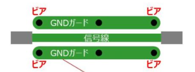

# **配線・回路**
{: .no_toc }

## 目次
{: .no_toc .text-delta }

1. TOC
{:toc}

## 基板上の配線
### 角度
基板において配線を直角にすることは望ましくありません、というのも角で電流の反射が起こるからです。  
配線パターンは直角になることを避け、45度ずつ曲げることでノイズを抑制することができます。
### ビア
基板上に通信線を引くとき、基本的には片面のみで引くことが望ましいです。というのも、ビアを使うことによりその部分の配線を直角にしてしまうからです。
### GNDガード
信号線の周りをGNDパターンで囲うことを言います。ケーブルでもシールドと言って外側をGNDで囲む場合がありますが、これと同じです。信号線のノイズを外部に漏らさないとともに、外部からのノイズを遮断することができます。  
このとき、GNDガードは一定以上の太さがあり、また十分に狭い間隔(10~20mm)でビアが空いているとよいです。  

## コードによる配線
基板同士、基板とアクチュエータとの通信にではコードを用います。

### PWM

### GROVE規格

### XH規格

### SPI通信

