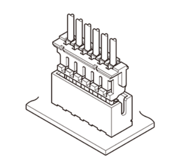

# **コネクタ紹介**
{: .no_toc }

## 目次
{: .no_toc .text-delta }

1. TOC
{:toc}

コネクタの種類は本当にたくさんありますが、ここでは大学生が作るようなロボットに多く使われるコネクタに絞って解説していきます。  

## コネクタの各部名称
コネクタは基本的に3つのパーツで構成されます。  

|番号|名称|役割|
|---|---|---|
|1|housing(ハウジング)|コードを固定する|
|2|contact(コンタクト)|コードをまとめておく|
|3|post(ポスト、ベース付きポスト)|コネクタを指す側。基板に付ける。|

また、ポスト側のことをメスコネクタ、コンタクトをオスコネクタと呼ぶこともあります。

  

このとき、コードからコードまでの間隔をピッチと呼びます。間違えると全然くっつかないコネクタができあがります。

## 電源に使われるコネクタ
電源のコネクタを考えるうえで大事なのが、定格電流にあったものを選ぶことです。  
基本的に大電流が流れることが想定される電源周りのコネクタは、下で紹介するような強いものを使いましょう。  
また、電源のコネクタは1番がGNDになるイメージがあります。

### XTコネクタ
電源と言えばこのコネクタです。外しやすいのに外れない、向きを間違えない、はんだ付けもしやすい。もう最高です。  
XTコネクタには主に3種類あり、XT30,XT60,XT90となっています。それぞれ30,60,90Aに対応しているコネクタで、サイズもだんだん大きくなります。  
  
コード部分を保護できるパーツがついたバージョンもあります。xt60hというそうです。  
  
また、bldcモータなどに使われる、3ピンのものもあります。これはxt30のみです。
  
ちなみに、XT60iというコネクタもあるそうで、こちらだと通信線が追加されている。何に使うかはよくわからないです。

最近では中華で大電流を流しながらかつ通信もできるコネクタとしてXT(2+2)というコネクタがあるそうです。
  

ちなみに、xhコネクタにおいて、オスはこっちです。  

### Tコン
見たまんまです。Tの形をしています。  
定格は書いてあるそうですが、だいたい20Aらしいです。  
よく、ラジコン用のバッテリーとかに使われているイメージです。絶対に逆接をしないいいコネクタですが、あんまり見かけません。  

### VHコネクタ
くそコネクタです。向きわかんないし、配線用しかないし、いいとこありません。使うもんじゃありません。  

## 通信に使われるコネクタ(JST)
日本でロボットに多く使われるのはJST(日本圧着端子製造会社)のコネクタです。
### XH

|||
|-|-|
|ピッチ(mm)|2.5|
|極数|1~15,16,20|
|定格電流(A)|3|
|定格電圧(V)|250V|

使いやすい(と個人的には思う)コネクタです。  
つめをひっかけるところが大きいので比較的取れやすく、それでいて勝手にとれることがないイメージです。  
さらに、コネクタの中では比較的サイズが小さいことも一押しポイントです。  

### EH

|||
|-|-|
|ピッチ(mm)|2.5|
|極数|2~15|
|定格電流(A)|3|
|定格電圧(V)|250|

ひっかけるところがなくて、コードをつかんでとってしまいがちです。コードが抜けます。  
あまり抜き差ししないところでは使いやすいと思います。  

### ZH

|||
|-|-|
|ピッチ(mm)|1.5|
|極数|2~13|
|定格電流(A)|1|
|定格電圧(V)|50|

小さいコネクタ。KONDOのサーボに使われています。
定格電流が小さく、かつ基板、コネクタ周りを小さいスペースに収めたいときに有用です。  

### PH

|||
|-|-|
|ピッチ(mm)|2|
|極数|2~16|
|定格電流(A)|2|
|定格電圧(V)|100|

あんまり使った記憶がないですが、なんとなく取りやすそうな形をしているなーと思っています。  

### XA

|||
|-|-|
|ピッチ(mm)|2.5|
|極数|2~15,18,20|
|定格電流(A)|3|
|定格電圧(V)|250V|

ものすごく取り外しがしやすかったような記憶があります。  
よく取り外すところに使うといいかもしれません。  

## 世界標準(?)のコネクタ
### デュポンコネクタ

|||
|-|-|
|ピッチ(mm)||
|極数||
|定格電流(A)||
|定格電圧(V)||

一番よくみるコネクタなのに、いざ注文しようとすると何て名前かわからないやつです。  
このコネクタの名前を探し当てるのにどれだけ苦労したことか。  
ブレッドボードで試作をするときに使うコネクタです。サーボのコネクタになっていることもあり、本番用のロボットに使われることもありますが、基本的にはお勧めしません。時間があればほかのもっと強いコネクタにつけかえるようにしましょう。  

### grove

|||
|-|-|
|ピッチ(mm)|2|
|極数|4|
|定格電流(A)|2|
|定格電圧(V)|100|

中華コネクタです。ユニバーサルコネクタとも呼ばれており、4線で通信する規格を統一しようという目的のもと作られています。  
PHコネクタをベースにつくられているそうです。  
このコネクタは4ピンのものしか存在しません。しかし、基本的にロボットの通信は4本で済むので問題ないでしょう。  
コネクタとしてではなく、ケーブルに接続された状態で販売されていることが多いです。そのため値段が高いイメージがあります。普通に自分で圧着しましょう。  
また、コネクタの規格と同時に通信線の順番や色も規格化されています。ありがたいですね。([通信の配線](../025_communication/013_wiring)参照)  
めちゃくちゃ取りやすいらしいんですが、あんまり売ってないのと、高いです。個人的にはあんまり使わないかなーとおもってます。  
  
  

## ロボットケーブル
名前の通り、ロボットによく使われるケーブルだそうです。  
高いので使ったことはありませんが、工業向けアームロボなどに使われているらしく、ねじりや曲げに強いかつ、ノイズが乗りにくいそうです。  

