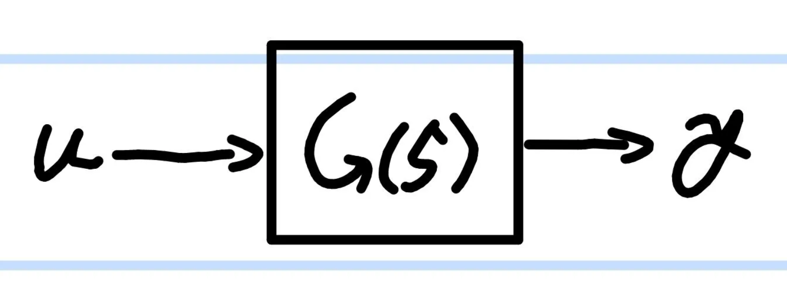
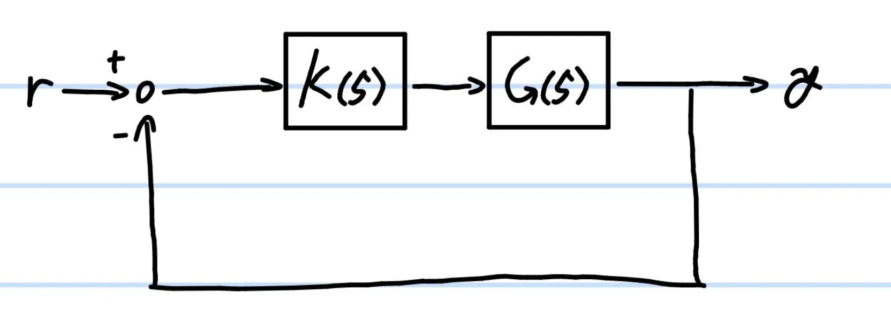

# **ブロック線図**
{: .no_toc }

## 目次
{: .no_toc .text-delta }

1. TOC
{:toc}

## システム
制御工学において、制御対象は数式として表されます。そして入力に対してある出力が得られるような数式(つまり制御対象)のことを"システム"と呼びます。  
ここで、システムは必ずしも制御対象のみであるとは限りません。制御器も含めた入出力関係を含むものをまとめてシステムと呼ぶこともあります。  
システムとは特定の式で出力が表される入出力関係なのです。

## ブロック線図
ブロック線図とは入力がどの順をたどって最終的な出力にたどり着くかを可視化した図です。  
  
四角の中のG(s)が伝達関数で、これはG(s)というシステムにuという入力を加えたら、yという出力をかえす、という図になっています。  

例えばサーボモータを例に上げましょう。G(s)がサーボモータ全体を表している場合、角度を入力uとして与えると、モーターが動き、特定の角度yが返ってくる、というイメージです。y=uじゃないか、と思うかもしれませんが、それは最終状態であり、実際には時間遅れなども考慮しなければいけないためyとuは異なっています。  

さらに、ブロック線図は分岐したり、複数つなげたりすることができます。  
  
この図では出力yが入力rに戻され、r-yの値がK(s)に入力されることが分かります。このように、白丸を使うことで出力同士を足し引きすることが出来るのです。

## 開ループ、閉ループ
ブロック線図はその形状で2種類に大別されます。それが、開ループと閉ループです。  
開ループは出力が戻されない場合を指し、入力から出力までが真っすぐつながっています。  
反対に閉ループとは、フィードバックがあるものを指し、上で挙げた例も閉ループになっています
  
閉ループの例
