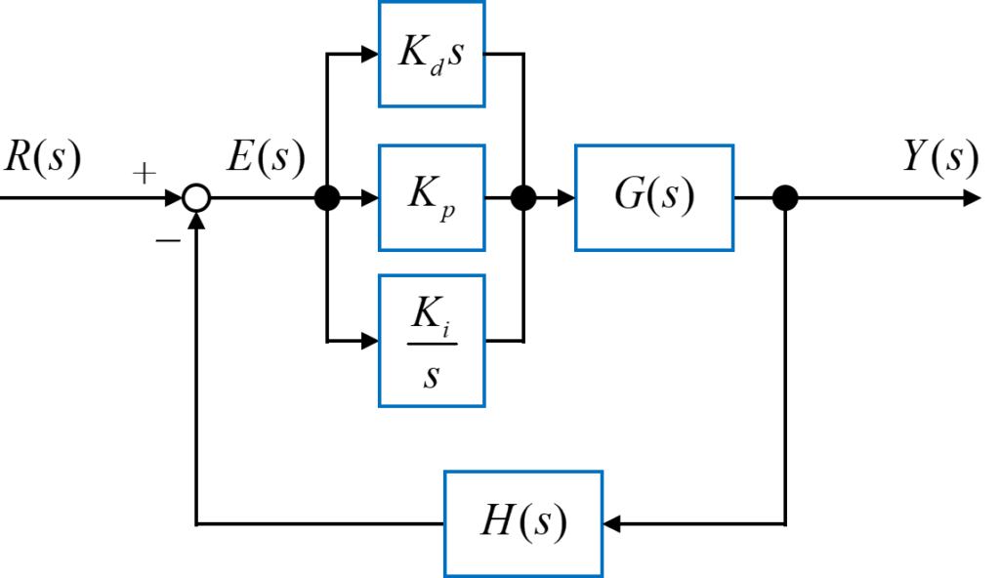
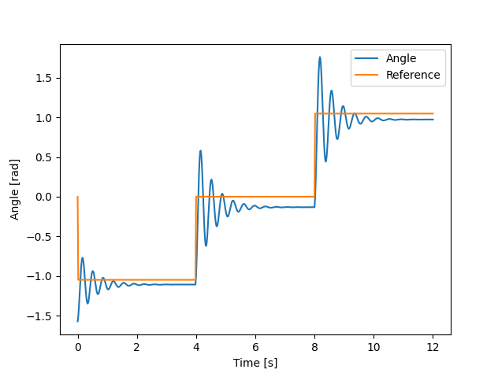
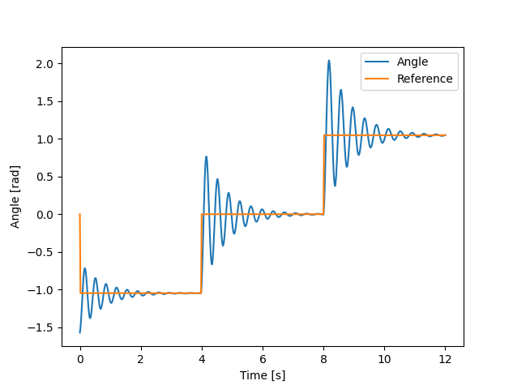
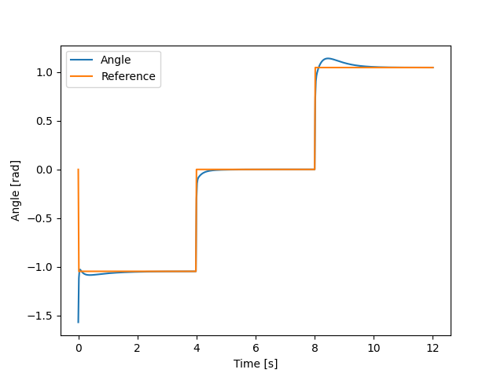

# **PID制御**
{: .no_toc }

## 目次
{: .no_toc .text-delta }

1. TOC
{:toc}

## 概要
ロボコンで用いられている制御のほとんどがPID制御を用いています。  
フィードバック制御の中で簡単なものであり、かつかなり高精度に制御ができるため、実世界でも幅広く使われています。比較的モデルが単純な場合に効果を発揮するため、モデルが複雑な人型や高い精度が要求されるサーボモータの制御には向きませんが、大学生レベルが使うには十分な制御理論です。  

## 原理
PID制御のブロック線図は次のようになっています。  
  
ここでGは制御対象、H(s)はセンサーのノイズ除去やオフセット用の変換を表しています。  
そして$$K_d, K_p, K_i$$はそれぞれゲインと呼ばれる定数す。  
さらにRは目標値を、Eは目標値から実際の値(Y)を引いたErrorを表しています。  
[ラプラス変換](../010_model/010_transfer_function)でやったことを思い出してもらえば、dの項ではエラーを微分し、pの項ではそのまま、iの項では積分して使っていることが分かります。  

||意味|効果|
|---|---|---|
|p|比例|差が大きいほど入力を大きくする|
|i|積分|差があるのに外力と釣り合ってしまったときに入力を大きくし続ける|
|d|微分|急激な入力の変化を妨げる|

この3つのパラメータを調節することで

## 数式的理解

## 速度制御・位置制御
速度制御と位置制御のそれぞれを行うにあたり、PIDの全てのゲインを使う必要はありません。  
まず、Pゲインは常に必要です。これがないと基本的に制御が動作しません。では、i,dはどうでしょうか？実はそれぞれのゲインにはデメリットがありませう。  
Iゲインは、外力が存在しない環境ではノイズとなり、帰って振動が大きくなってしまいます。  
Dゲインは、応答速度を遅くするため、振動がそれほど気にならない環境では帰ってノイズになります。  

ここで、速度制御と位置制御について考えてみましょう。  
速度制御では制御対象(たいていはタイヤなど)に外力がかかることが多いです。というのも、タイヤが直接ロボットを駆動させるので、動作に用いる力に従ってモータに直接モーメントがかかるからです。そのため速度制御ではIゲインが重要になり、Dゲインはほとんど必要亡くなります。というのも、外力によって振動成分をおさえることができるからです。  
位置制御では制御対象(直動やサーボモータ)にそれほど大きな外力がかからない、または一定の外力しかかからないことが一般的です。外力が一定の場合はあらかじめオフセットのトルクを設定しておく、などの対応が考えられるでしょう。この場合振動をなくすDゲインが重要となり、Iゲインはほとんど必要なくなります。外力がかからないため帰って振動を生んでしまうからです。

## 限界感度法
PIDのゲイン調節にはさまざまな方法があります。数値的に計算することも可能ですが、面倒だし制御対象の物理モデルがわからないことが多いです。そのため、ゲイン調節は熟練の技となることが多いのです。  
熟練、と言ってもコツはあり、これが限界感度法です。  
簡単に説明すると、ゲインを1種類ずつ決めていく方法で、それぞれのゲインで制御対象の動作が限界に近づくまで調節をし続ける、という方法です。  

|順番|ゲイン|限界値|
|---|---|---|
|1|比例P|対象が振動しないところとするところの境目|
|2|積分I|外力に対して目標値に収束するようになるところ(かつ、振動はPゲイン調節の時よりも増大しない)|
|3|微分D|振動しなくなるところ|

一応これがセオリーと言われていますが、制御対象の特性によっては調節の順番を変える必要が出て気います。例えばあまりに応答速度が速い場合にはあらかじめ一定のDゲインを加えて置き、振動を抑制した状態でゲイン調節を始める、などのの工夫が考えられるでしょう。  
また、常に応答速度が速いものがよい、というわけでもありません。早すぎる応答が機械に支障をきたすような場合はPゲインをあえて小さくし、Iゲインでそれを補うことでゆっくりと応答するシステムを作ることができます。(速度制御の時の例)  

では、限界感度法でゲインを調節するとどうなるか見てみましょう。  

まず、pゲインを調節します。この時点である程度早く目標値に到達し、かつ収束が比較的押さえられます。  
   
次に、iゲインを調節します。こうすることで目標値への定常偏差をなくすことができます。振動は多少増えますが、目標値に到達できるようになります。  
  
最後にdゲインを調節します。これにより、振動を最低限にすることができます。  
  

一度で調節できることはあまりないので、iやdを小さくしながらp->i->dの順で調節を続けましょう。
