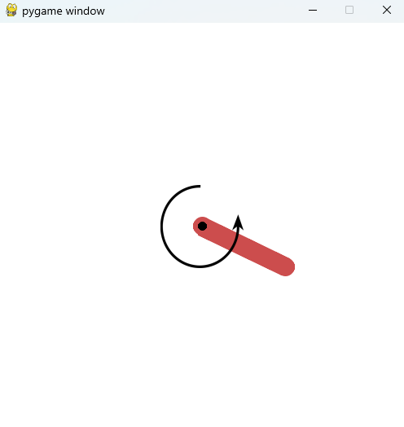

# **PID制御の実装**
{: .no_toc }

## 目次
{: .no_toc .text-delta }

1. TOC
{:toc}

このページを書いた後にコードを変更しているので画像と異なるシミュレーションやグラフが出てくるかもしれませんが、動けば大丈夫なはずです。  

PID制御を体験してみましょう。  
まずは、Robo-MECSの演習用githubをcloneしてください。
```shell
git clone https://github.com/Robomech-UEC/Robo-MECS_exercise.git
```
ファイルの中の`004_control/002_feed_back/pole_simulation`に今回使う、ポールのシミュレーション環境が入っています。まずは実行してみましょう。  
必要なlibararyをインストールします。  
```shell
pip install gymnasium pygame matplotlib pandas
```
ではまずは実行してみましょう
```shell
python example.py
```
もしかしたらほかに必要なlibraryがあるかもしれません。適宜インストールしてください。  
成功すると12秒のシミュレーションが流れ、その後グラフが表示されるはずです。  
  
  

ここまでできたら、`004_control/002_feed_back/pole_simulation/example.py`を編集していきましょう。  
##################################で囲まれているところが編集するところです。  

一番調節するのはここです。
```python
# PID controller gains
# ここに制御ゲインを書く。
##################################
k_p = 0
k_i = 0
k_d = 0
##################################
```

角度の正規化プログラムを書きます。
```python
# angle normalization
def normalize_angle(angle):
    # 角度の正規化プログラム
    ##################################

    ##################################
    return angle
```
角度の正規化とは、角度を-piからpiまでに制限することです。  
これをしないと、2piを超えた角度が出力されてしまったときにエラーの値が大きくなりすぎ、入力がおかしくなってしまいます。  
数式的に考えると  
$$angle = \pi$$

PID制御を実装します。  
```python
# PID control
# ここに制御則を書く。
##################################
# 現在のpoleの角度と、目標角度
angle = pole.angle()
reference = refs[ref_id]

# エラーを計算し、エラーの差分と、積分も計算する
# いったん、エラー0を代入
error = 0
# エラーを正規化する
error = normalize_angle(error)

# トルクを計算し、poleに入力する(pole.torque_input())
# いったん、トルク0.1を入力
pole.torque_input(1.8)
##################################
time.sleep(dt)
```
角度と目標値を受け取り、
