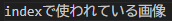

# **サブページ**
{: .no_toc }

## 目次
{: .no_toc .text-delta }

1. TOC
{:toc}

## サブページ
サブページのテンプレートです。  
このように1つしかファイルが存在しなくても、フォルダを作り、index.mdの中に本体を書き込んでください。  
フォルダ名は`001_subpage_template`としました。  
これを参考に、3桁の数字を頭に持ってきたフォルダ名にしてください

## 目次の自動生成
目次が自動生成されるように、このテンプレートを利用してください

### 小さい目次
小さい目次も表示されます。

## imgs
フォルダを作成し、中にindex.mdを入れたらimgsフォルダを作成しましょう。関連する画像はここに入れてください。pathが短くなってアクセスしやすくなります。  
  
の名前は`index_`から、n番目の子ページで使われている画像は`n_`から名前を始めてください。([sub_sub_page](../004_subpage_2_template/001_sub_sub_page_tesmplate_1)参照)  

## state
後の編集者のために(自分のためにも)、ページの編集状態をfront matterに記載しましょう。この場合、書き終わっているのでdoneです。
