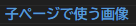

# **サブサブページ1**
{: .no_toc }

## 目次
{: .no_toc .text-delta }

1. TOC
{:toc}

## ファイル構造
最後の子ページを持たないファイルは、親のindex.mdと同じ階層に設置しましょう。見やすくていいです。

## 子ページで使う画像
  
には、`子ページ番号_`から始まる名前を付けてください

## 編集中
編集中の場合はstateをeditingにしておいてください。  
残りの編集を先の人に任せてしまっても構いません。  

