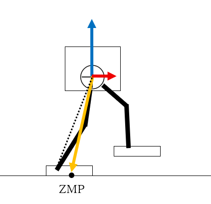

# **Gait Control Overview**
{: .no_toc }

## 目次
{: .no_toc .text-delta }

1. TOC
{:toc}

人型の歩行理論について、3年生の夏の時点で話せるところまでをひとまずまとめてみたいと思います。

## 歩行って何？
歩行とは、何でしょうか？  

まずは自分がどうやって歩いているか、言葉で表現してみましょう。  
- 直立状態
- 右足を前に出す
- 体の重心をだんだん前に出す
- 右足をついたら重心を右足の方に移す
- 右足の上で重心が安定したら左足を上げる
- 左足を前に出す  

ひとまずこんなところでしょうか。  
でも、こういうことを考えながら歩き始めると途端に動作がぎこちなくなると思います。面白いですね。  

では次に、歩いている途中で急に止まってみてください。   
おそらく歩いている途中の体勢で硬直すると、倒れてしまうと思います。つまり、人間の歩行のどの部分を切り取っても安定な瞬間は存在しないのです。  
不安定な状態を続けることで、人間は移動しています。  

## Reduced Order Model
Reduced Order Model(ROM, 低次元モデル)とは、複雑な力学系を持つロボットを制御する際に使われる簡略化モデルのことです。  
ヒューマノイドは多くの関節を持ちますが、そのほとんどは end effector が冗長な動きをできるようにするための関節であり、直接制御する必要のない部分です。  
そのため、物理モデルを用いて制御する時には本当に重要な部分のみに絞ってモデル化し、動作を考えるのが一般的です。

## Linear Inverted Peudulum
### Background
Linear Inverted Pendulum model (LIP model, 線形倒立振り子)とは、ヒューマノイドの Reduced Order Model の一つです。  
  
このモデル自体は古くから存在しますが、近年まで使われ、またほかのモデルのベースとなったものです。
ホンダのASIMOやカワダロボティクスのHRP-2の歩行理論にもこのモデルは使われています。また、Boston DynamicsのAtlasも初期はこのモデルを使っていました。  
  
これらのロボットの歩行に共通して言えることは、重心を上下させずに滑るように歩いているという点です。これはLIPモデルを使って歩行させる際に生まれる拘束条件になっており、重心がZ方向に変化しないことをもとに物理式を解いています。  

LIPモデルを用いた制御理論について知りたい場合は、梶田先生のヒューマノイドロボットという本をお勧めします。日本語だし、逆運動学のあたりから安定化制御までかなーリ細かく書いているので非常にわかりやすいです。  
この本を読めば、ちゃんと動くヒューマンが作れます。

### LIPモデルとは
さて、LIPとはどのようなモデルでしょうか?  
倒立振り子モデルとは、支点と重心のみで構成される単純なモデルです。これに線形要素が加わると、足の長さが変化できるようになります。  
このモデルは人間でいうところの足と重心を再現したものになり、実際には2つの倒立振り子を交互に地面につけることで歩かせています。足の長さに自由度を持たせ、また地面との接地を点で表すことで人型をモデル化しているのです。  

### 2 dimensional LIP
ここで、LIPを揺らすとどのような動きをするのか考えてみましょう。長さの拘束条件として重心のz軸高さが変わらないものとします。  
まずは2次元で考えると、少し傾いているLIPに強い力をかけたときと、弱い力をかけたときで挙動が変わります。  
強い力をかけると、支点の反対側まで倒れます。反対に弱い力だと戻ってくるでしょう。これが、Center of Mass(COM, 重心)の動きのx軸方向、y軸方向となるのです。    
  

詳しく説明していきましょう。  
まず、進行方向(x方向)への動きを考えます。これは上の強い力で押した場合、に当たります。  
支点(つまり足)を越えて前に倒れていく重心に対し次の足を出せば、歩行になります。  
  
このとき特に、片足のみで重心を支えている区間を single support(片脚支持), 両脚で支えている区間を double support(両脚支持)と呼びます。  
  

次に、y方向への動きを考えます。これは弱い力で押した場合に当たります。  
  
歩くときには両方の足に順番に荷重をかけるために体を左右に揺らしながら動くと思います。この動きが、支点を越えずに戻ってくる振り子によって再現されています。

### 3 dimensional LIP
ここまでは2Dで倒立振子の動きを見てきましたが、x,y方向の動作をまとめてみてみましょう。左右の足が同時に重心を支えている部分が両脚支持期間です。  
歩行軌道の生成において、ここでは始めに足位置を決めています。正確に言うと、重心速度を定めることで足位置が決定され、それに基づいて重心の移動を計算しています。  
足位置と重心位置が決定されれば、逆運動学を解くことで足の関節をどのように動かせばよいかが分かります。  

  

### 倒立振子の物理的理解
  
人型の歩行理論では、倒立振子の支点に力がかからず、かつ重心のz座標が一定であるという制約をかけます。これに基づいて振り子の物理式を立てると次のようになります。  
$$M \ddot x = f sin\theta 
= \frac{Mg}{cos\theta}sin\theta 
= Mg \tan{\theta} 
= Mg \frac{x}{z}$$  
$$\ddot x = \frac{g}{z}x$$
この時、髙さ一定の条件から$$f = \frac{Mg}{cos}\theta$$を用いています。  

この式を解くと、倒立振子の解析解が得られます。  
$$ x(t) = x(0) cosh ( t / T_c ) + T_c \dot x(0) sinh (t/T_c) $$
$$ \dot x(t) = x(0) / T_C sinh (t/T_c) + \dot x(0) coah (t/T_c)$$
where
$$ \space T_c = \sqrt{z/g}$$

ここまでは2次元の倒立振子についてでしたが、これを3次元に広げてみましょう。

### 歩行速度調節の理論
ここまでで、一応歩くことができそうな重心のモーションを作ることができました。次に考えなければいけないのが、重心を適切な速度で動かす方法です。  

2次元で考えた、x軸方向の絵を思い出してください。  
この時、足の切換タイミングがずれるとどうなるか、考えてみましょう。  
  

歩行モーションの作成はまず足位置から始める、という説明をしましたが、速度調節はこの足位置を変化させることで行います。  
写真では現在の支持脚に対する足の切換タイミングが一定です。それに対し、次の足に入るタイミングが変化していることが分かります。  

①次の足位置を手前に移動した場合  
この場合、さらに次の足に移るときの重心速度が速くなります。これは、倒立振子が次の足位置に移った時、地面と振子の角度に対する速度が速くなるためです。これにより重心が足の真上に来た時の速度が速くなります。  
②次の足位置を奥に移動した場合
この場合、速度は遅くなります。上の場合と逆で、重心が足位置の上にあるときの速度が遅くなります。  

ここで重要なのが、速度を変化させるのは一度飲み、ということです。  
基本的にLIPの歩行理論は速度を生み出すものではなく、重心速度を維持する

どの程度足位置をずらせばよいかは、計算から求めることができます。

### Supporting Poligon
Supporting Poligon(支持多角形)とは、ヒューマンモデルにおいて重さを支えている面積のことです。  
片脚支持の場合は足の面積分、両脚支持の場合は2つの足をつないだ面積が支持多角形となります。  
支持多角形は安定化について議論するうえで非常に重要になってきます。

### Zero Moment Point
  
Zero Moment Point(ZMP)とは、荷重によるモーメントが0になる点です。具体的には、線形倒立振子が重心に対して生じる加速度ベクトルを考え、それを床面に投影したものです。  
この1点が支えられていた場合、物体は安定になります。というのもこの点にかかる力のベクトルは重心を通るため、ZMPが安定であれば物体は倒れないからです。つまり、ZMPでは水平モーメントが0になり、垂直モーメントのみ存在すします。  

そのためZMPが支持多角形の中に入っていればその物体は安定である、という理論が成り立ち、ロボットを常に安定に歩行させるためにはZMPを支持多角形の中に保つ、という方法があります。  
ZMPは理論値であり、測定することはできません。そのため現在のロボットの状態からモデルを用いて計算で求めるものになります。

### Center of Pressur
Center of Pressur(CoP)とは、支持多角形の中で最も垂直圧力が高い点である。理論上この点では水平圧力は0になり、ZMPになります。  
しかし実際には滑りやセンサー誤差によりCoP = ZMPとはなりません。そのため、CoPと計算により求めたZMPを比較し、ロボットの状態を評価するのです。  

ZMPとCenter of Pressurがずれるのは例えばこのような場合が考えられます。  
  

### Ground Reaction Force
Ground Reaction Force (床反力) とは、足裏センサーによって計測される、床からの反発力を指します。これと足首関節トルクを用いることでZMP(CoP)を計算することができます。

### ZMPを規範とした歩行生成
ここまで考えてきた歩行モーションの生成では足位置→重心位置を決定することで、ZMPを制御していました。しかし、重心運動の計算には Reduced Order Model を用いているため、生成されるZMPは安定したものになりません。  
そこで、足位置の後に先にZMPを決定し、そこからさらに重心位置を計算するという手法があります。  
ここで用いられるのが Cart Table model (テーブル台車モデル) というモデルです。  
このモデルは線形倒立振り子の拡張で、ZMPの位置がより見やすくなっています。  
  
ZMPの式を離散化すると、単位時間ごとの重心位置ベクトルに変換行列をかけることで単位時間ごとのZMP位置を求められるようになります。  
つまり、その変換行列の逆行列を用いればZMPから重心位置が求められる、ということです。  

ZMPは基本的にぶれない方がよいとされており、さらに地面の接点と同一であった方がより安定とされています。  
ただ、実際に人間の歩行を考えると歩いているときに常にある1点がCenter of Pressurになってはいないことが分かると思います。そのため、私としてはZMPを片脚支持の時に固定しておくことは制御として正しいのか少し疑問ではあります。  
しかし，特に解決は思いつかないのでいったん保留します。接点からZMPがずれないことを安定とすると、理想的なCenter of MassとZMPの軌跡は次のようになります。  
  
ZMPがジャンプしている区間が両脚支持期間になります。  
このジャンプでは、両脚支持の瞬間に途切れることなくできるだけ線形に動く必要があります。これについて取り扱った論文として、[Fast Online Trajectory Optimization for the Bipedal
 Robot Cassie](https://www.roboticsproceedings.org/rss14/p54.pdf) があります。この論文では vertex weightings という名前でCenter of Pressur を扱い、両脚時期間中の Supporting Polygon の中の vertex weighting ポイントの移動について制御しています。   

## Spring Loaded Inverted Pendulum
Spring Loaded Inverted Peudulum (SLIP) とは、LIPのモデルにバネを追加したヒューマノイドの物理モデルです。  
  
LIPとの最大の違いは、歩行の途中に宙に浮くタイミングがあっても同じモデルで扱うことができるという点です。  
使ったことがないので詳しいことは言えないのですが、動作の基本はLIPと同様です。  
LIPとの最大の違いはCenter of Massのz方向運動で、バネの伸び縮みを考慮し、片脚支持の場合に重心が下がるようになっています。  

さらにヒューマノイドが飛行する場合について扱うモデルとして、重心部分にホイールを加えたモデルが存在します。これは Flywheel SLIP と呼ばれています。  
この場合ホイールは上半身にかかるモーメントを意味し、飛行中に手を動かしたり、そもそも体があることによって生じる慣性力を考慮して全身運動について議論することができます。  

参考になる論文です。  
- [Bipedal Hopping: Reduced-order Model Embedding via Optimization-based Control](https://www.researchgate.net/publication/330595562_Bipedal_Hopping_Reduced-Order_Model_Embedding_via_Optimization-Based_Control)  
SLIPのモデルの物理特性について詳しく書かれています。
- [Fast Online Trajectory Optimization for the Bipedal
 Robot Cassie](https://www.roboticsproceedings.org/rss14/p54.pdf)  
SLIPモデルを用いた歩行理論の基礎が書いてあります。
- [Feedback Control of a Cassie Bipedal Robot: Walking, Standing, and Riding a Segway](https://arxiv.org/abs/1809.07279)  
Cassieの安定化制御についてをメインに書かれています。
- [Sequential Motion Planning for Bipedal Somersault via Flywheel SLIP and Momentum Transmission with Task Space Control](https://www.researchgate.net/publication/343498582_Sequential_Motion_Planning_for_Bipedal_Somersault_via_Flywheel_SLIP_and_Momentum_Transmission_with_Task_Space_Control)  
Flywheel SLIP モデルを用いたジャンプ運動について書かれています。  

SLIPモデルを使ったことがないので詳しくは分かりませんが、ここら辺を読めば一応実装はできるんじゃないかなと思っています。

## Swing Foot Trajectory
Swing foot (遊脚)とは、片脚支持の時に地面に設置していない足をのことです。  
基本的に遊脚はどう動かしてもよいということになっており、制御をする場合も誤差修正に対する重みをかなり小さくすることが多いです。  
遊脚の運動で制御すべき点は、足が接地するタイミングです。  
安定した歩行を実現するためには接地の瞬間に足先の地面に対する速度、加速度が0である必要があります。  
そのため、遊脚の制御を行う場合は接地の瞬間の速度、加速度を拘束条件として式を立てたうえで制御パラメータにも用いるという手法が存在します。  
また、以前明研で見た卒論では接地の瞬間に足を引くことで制御をかけずとも速度・加速度0を再現できる、という研究がありました。

## 歩行安定化制御

