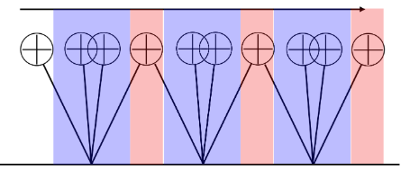

# **Gait Control Overview**
{: .no_toc }

## 目次
{: .no_toc .text-delta }

1. TOC
{:toc}

人型の歩行理論について、3年生の夏の時点で話せるところまでをひとまずまとめてみたいと思います。

## 歩行って何？
歩行とは、何でしょうか？  

まずは自分がどうやって歩いているか、言葉で表現してみましょう。  
- 直立状態
- 右足を前に出す
- 体の重心をだんだん前に出す
- 右足をついたら重心を右足の方に移す
- 右足の上で重心が安定したら左足を上げる
- 左足を前に出す  

ひとまずこんなところでしょうか。  
でも、こういうことを考えながら歩き始めると途端に動作がぎこちなくなると思います。面白いですね。  

では次に、歩いている途中で急に止まってみてください。   
おそらく歩いている途中の体勢で硬直すると、倒れてしまうと思います。つまり、人間の歩行のどの部分を切り取っても安定な瞬間は存在しないのです。  
不安定な状態を続けることで、人間は移動しています。  

## Reduced Order Model
Reduced Order Model(ROM, 低次元モデル)とは、複雑な力学系を持つロボットを制御する際に使われる簡略化モデルのことです。  
ヒューマノイドは多くの関節を持ちますが、そのほとんどは end effector が冗長な動きをできるようにするための関節であり、直接制御する必要のない部分です。  
そのため、物理モデルを用いて制御する時には本当に重要な部分のみに絞ってモデル化し、動作を考えるのが一般的です。

## Linear Inverted Peudulum
### Background
Linear Inverted Pendulum model (LIP model, 線形倒立振り子)とは、ヒューマノイドの Reduced Order Model の一つです。  
  
このモデル自体は古くから存在しますが、近年まで使われ、またほかのモデルのベースとなったものです。
ホンダのASIMOやカワダロボティクスのHRP-2の歩行理論にもこのモデルは使われています。また、Boston DynamicsのAtlasも初期はこのモデルを使っていました。  
  
これらのロボットの歩行に共通して言えることは、重心を上下させずに滑るように歩いているという点です。これはLIPモデルを使って歩行させる際に生まれる拘束条件になっており、重心がZ方向に変化しないことをもとに物理式を解いています。  

LIPモデルを用いた制御理論について知りたい場合は、梶田先生のヒューマノイドロボットという本をお勧めします。日本語だし、逆運動学のあたりから安定化制御までかなーリ細かく書いているので非常にわかりやすいです。  
この本を読めば、ちゃんと動くヒューマンが作れます。

### LIPモデルとは
さて、LIPとはどのようなモデルでしょうか?  
倒立振り子モデルとは、支点と重心のみで構成される単純なモデルです。これに線形要素が加わると、足の長さが変化できるようになります。  
このモデルは人間でいうところの足と重心を再現したものになり、実際には2つの倒立振り子を交互に地面につけることで歩かせています。足の長さに自由度を持たせ、また地面との接地を点で表すことで人型をモデル化しているのです。  

### 2 dimensional LIP
ここで、LIPを揺らすとどのような動きをするのか考えてみましょう。長さの拘束条件として重心のz軸高さが変わらないものとします。  
まずは2次元で考えると、少し傾いているLIPに強い力をかけたときと、弱い力をかけたときで挙動が変わります。  
強い力をかけると、支点の反対側まで倒れます。反対に弱い力だと戻ってくるでしょう。これが、Center of Mass(COM, 重心)の動きのx軸方向、y軸方向となるのです。    
  

詳しく説明していきましょう。  
まず、進行方向(x方向)への動きを考えます。これは上の強い力で押した場合、に当たります。  
支点(つまり足)を越えて前に倒れていく重心に対し次の足を出せば、歩行になります。  
  
このとき特に、片足のみで重心を支えている区間を single support(片脚支持), 両脚で支えている区間を double support(両脚支持)と呼びます。  
  

次に、y方向への動きを考えます。これは弱い力で押した場合に当たります。  
  
歩くときには両方の足に順番に荷重をかけるために体を左右に揺らしながら動くと思います。この動きが、支点を越えずに戻ってくる振り子によって再現されています。

### 3 dimensional LIP

## 

## 

