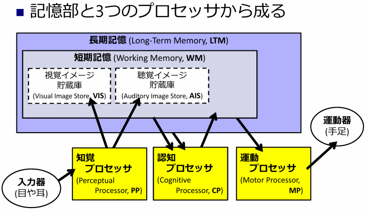
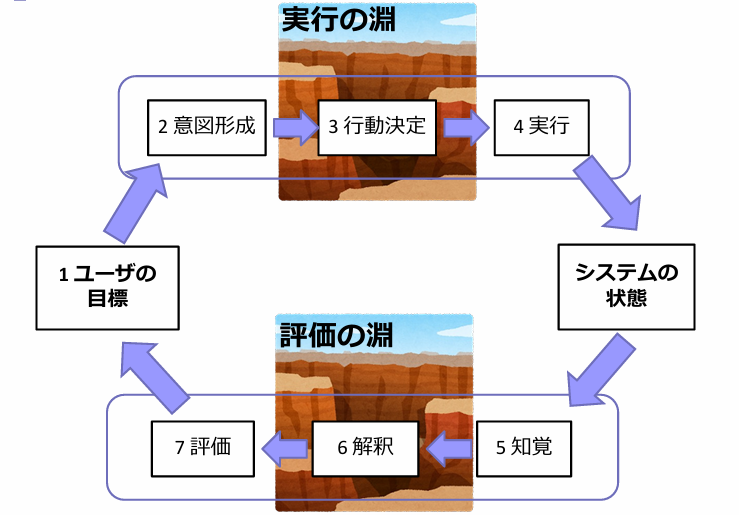
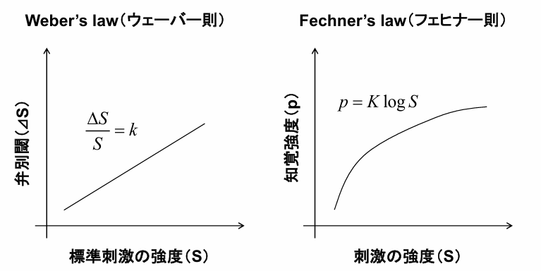
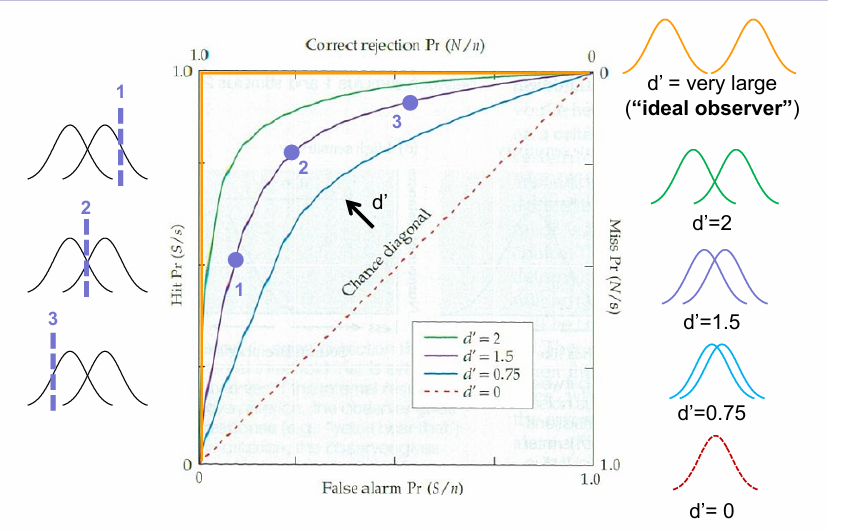
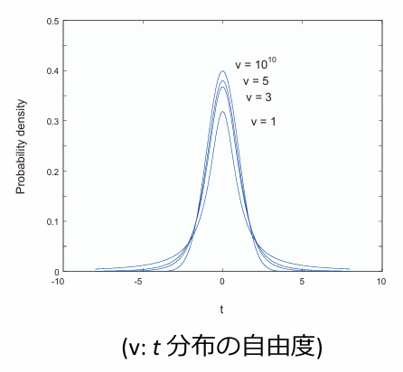
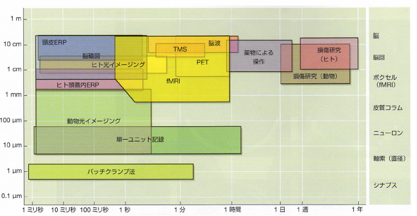
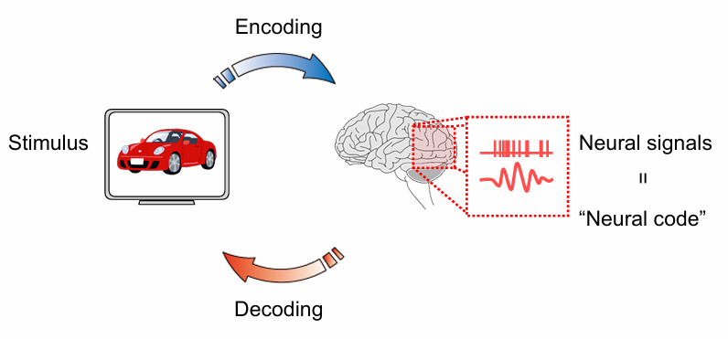
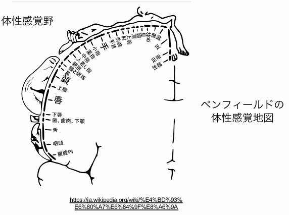

# 人間機械システム　テスト対策

## インタフェースにおける制約
### 〇 ユーザー動作の制約

| 名前 | 例 |
|------|------|
|物理的制約|SDカード、ハサミ|
|意味的制約|アイコン|
|文化的制約|進、戻るボタンの左右配置|
|論理的制約|GUIなどの動作に関する制約|

物理的制約について、反対にマウスや特殊なキーボードなどユーザーに大きな自由度を与えるものもある。

### 〇 マッピング
動作と結果の整合性をとる。  
例:  
ガスコンロ、教室スイッチ、乗車シート、フライトゲーム

### 〇 アフォーダンス
使い方の正しい認識を促す  
形状や大きさから、何に使うものなのかをはっきりとさせる。  
ドアノブの形状、段差or腰掛

### 〇 標準化
最終手段  
すでにつかわれている形状を流用する。  
エレベータのボタン、電源ボタン、保存ボタン、キーボード

## フールプルーフとフェイルセーフ
### 〇 fool proof
無意識に重要な操作をできないようにする。  
レンジ、洗濯機、SDカード

### 〇 fail safe
誤作動や誤操作を想定し、対策をとっておく。  
レバー式水道、ヒューズ、列車のブレーキ

## ユーザーモデルと設計モデル
- ユーザーモデル  
ユーザーが考える動作。メンタルモデル。  
ユーザーが経験を通して構築する。  
- 設計モデル  
実際の動作

2つの食い違いにより故障などが起こる恐れがある。
説明書はユーザが正しいモデルを作成する助けとなる。

## インターフェース全般

## ヒューマンモデル

### 〇 モデルヒューマンプロセッサ
記憶部と3つのプロセッサから成る。

- 知覚プロセッサ  
入力受け取り
- 認識プロセッサ  
中間管理職  
知覚、運動の接続のみの単純なものから推論、意思決定などを行う高度な物まである。  
- 運動プロセッサ  
自発運動の生成

#### パラメータ
- $$\mu$$  
記憶容量
- $$\tau$$  
処理に要する最小処理時間
- $$\delta$$  
記憶の減衰時間
- $$\kappa$$  
記憶される情報の表象コード

#### 特徴
心理学における研究成果をまとめ、入力から運動までの所要時間を算出した。  
人間における情報処理プロセスが整理された。  
情緒的な面は考慮外

### 〇 ノーマンの7階層モデル
意思決定および評価フィードバックを示す。

1. 目標を立てる
2. 実行する  
意図形成  
行動決定  
実行  
3. 評価する  
知覚  
解釈  
評価  

"目標を立てる"を含んだ7段階  

#### 淵
実行の淵(=実行)と評価の淵(=解釈)
が存在し、これらにユーザ目標とシステム上体との隔たりが生まれる。

#### 例
冷凍庫の温度調整
|モデル|行動|
|---|---|
|目標|冷蔵庫の温度を変えずに冷凍庫の温度を下げる|
|意図形成|冷凍庫のつまみを強に回す|
|行動決定|冷凍庫の扉を開け、つまみを回し、扉を閉める|
|実行|やる|
|近く|冷凍庫の温度計を見る、冷蔵庫のないの野菜の状態を調べる|
|解釈|冷凍室の温度は望み通りだが、冷蔵庫の温度も下がったことを知る。|
|評価|なぜ？|

ユーザーインターフェースにおいて、これらの隔たりを小さくすることが望ましい。

### 〇 ラスムッセンの3階層モデル
行為の自動化に注目したモデル。  
行為の自動化は以下の3つの認知階層に支配される。
- 技能ベース  
もっと熟達している。反射で行われる。  
赤信号で無意識にブレーキを踏む
- 規則ベース  
過去の経験から獲得したルールを用いる。  
止まれという意味の赤信号を見る→ブレーキを踏む
- 知識ベース  
外界を認知、解釈することにより心理モデルを構築
赤信号を見る→赤は危なそうだなと思う→ブレーキを踏む

## インタフェースの評価方法について

### 前項までのまとめ
- 定性的評価方法  
制約、マッピング、アフォーダンス、モデルの整合性、淵の評価
- GUI設計の指針という観点から  
直接操作、メタファー、undo、適度な量のモード、統一性、ターゲット層との乖離、適切なエラー

ここでは定量的に評価する方法を考える。  
定量化により複数のインターフェースを客観的に比較することができる。

### モデル

#### 〇 GOMSモデル  

|モデルの中身|内容|例|
|----|----|----|
|Goal|課題、なすべきこと|次の段落の冒頭単語を太字にする
|Operators|具体的な行為|カーソルをキーで移動、ツールバーからボタンを探す...etc
|Method|課題を達成する方法。複数オペレータからなる。|Operators動作の統合による手続き|
|Selection rules|複数の達成方法からどれを選ぶか|どの方法を選ぶか。ショートカットキーの方が早い...？|

GOMSモデルでは手順やゴールをさらに小さいものに分解することで評価することができる。

#### 〇 KLMモデル
GOMSモデルの定量化手法  
動作それぞれに時間を定義する。

ここは明日

- Fittsの法則  
マウスでポインティングするのにかかる時間
- Hickの法則  
複数項目から一つを選ぶのにかかる時間

## 心理物理学的実験手法全般について（特に，閾値の計測方法）
錯視の実験  

### 実験評価について
- 2件法、3件法  
YES,NOか、どちらでもないを入れるか。  
"どちらでもない"が選択肢に入るとこれを選びがちになり、良い結果が得られないこともある。  
2件法は研究側にとって、3件法は被験者にとってやりやすい

### 閾値について
ある刺激強度sに対し、被験者の知覚確率が50%になる点。  
一般にP(s)はシグモイドに従う  
$$P(s) = \frac{1}{1 + e^{-\frac{s-s_0}{\sigma}}}$$  

#### 〇 計測方法

|方法|特徴|利点|欠点|使いどころ|
|---|---|---|---|---|
|調整法|被験者が自分で閾値を調節する|直感的、簡単。感覚に敏感|再現性に劣る。恣意的|予備的探索実験|
|極限法|最大値、最小値から交互に試す|主観的誤差を抑える。比較的簡単で高精度|期待誤差(ヒステリシス)や慣れ|基礎的かつ精度の高い測定が求められる場合|
|上下法|変化したらもとに戻す。変化のさせ方は変えられる。|簡単、早い|閾値付近を繰り返すため被験者が疲れる。||
|恒常法|ランダムに提示し、知覚確率が50%になる点(**主観的等価点**)、つまり最も微妙な刺激条件を求める。|馴れの影響やヒステリシスが少ない|効率が悪い。時間がかかる。||

- P(s)の計算  
  - 調整法 : 
$$\frac{1}{n}\sum_{i=1}^{n}s_i$$
  - 極限法 : 
平均
  - 上下法 : 
$$\frac{1}{n}\sum_{i_1}^{n} r_i$$
  - 恒常法 : 
$$\frac{1}{1 + e^{-\frac{s-s_0}{\sigma}}}$$

- ヒステリシス  
過去の変化(履歴)に依存して出力が変わる現象
- 上下法について  
どのタイミングで刺激の上下を変えるかによって、被験者の感知率をある程度変化させられる。  
例えば 2up-1down 形式だと  
収束値 = $$P(s)^2$$  
という計算になる。
- 恒常法の閾値計算  
  - 刺激ごとの知覚確率を求める
  - シグモイドの物理関数をフィッティング
  - $$P(0) = \frac{1}{1 + e^{-\frac{s-s_0}{\sigma}}}$$
  - この時の$$s_0$$が閾値

## ウェーバー則とフェヒナー則について

刺激の差の知覚について、検出可能な最小差分をJND(just noticeable difference)と呼ぶ。  
ほぼ弁別閾を意味する。  

### 〇 ウェーバー則
差異閾値に関する法則。どれだけ変化したら人は違いとして認識するかを示した。  
刺激の変化の間隔は相対的な差であることを示す。  
強弱の激しい刺激には適用不可能  

$$\frac{\Delta S}{S}=k$$  
kはウェーバー比  

例:100gの重さに対し2gが識別できたならば、200gでは4gになる。

### 〇 フェヒナー則
刺激に対する感覚の大きさを示した。  
刺激が増加するにつれ、感覚は鈍くなることを示している。  
ウェビナー則では刺激の認識を扱ったが、フェヒナーでは刺激全体の感覚の大きさを扱っている。  

$$dp = K \frac{\Delta S}{S}$$  
$$p = K \log{S}$$ 
まとめて、  
$$E = k \log{\frac{S}{S_0}}$$  
dpは知覚変化量

## 信号検出理論について
微弱な刺激に対する判断を数理的に説明する理論。  
入力ありの場合も "Signal + Noise" となるのでにんしきしにくくなる。  
刺激に対する反応を以下のように分けた。  

|信号入力|判断|名称|
|---|---|---|
|True|True|Hit|
|True|False|Miss|
|False|True|FA(False Alarm)|
|False|False|CR(Correct Rejection)|

- 厳しいRegina、甘いJulie  
教官からの電話→Hit減少、Miss上昇→Regina  
彼女からの電話→CR減少、FA上昇→Julie

## d'の計算方法について
d' :=  弁別度  
刺激や信号を正しく区別する能力の指標。式は2種類ある。

- $$d' = \frac{r_+ - r_-}{\sigma_r}$$  

	刺激の応答分布(反応値r)の平均の差を標準偏差で割った値。  
	理論的な定義式。
	$$r_+$$が反応ありの場合の反応の平均(Hitスコア)
	$$r_-$$が反応なしの時の反応の平均(FAスコア)
	を示す。

- $$d' = z(CR率) - z(Miss率)$$  

	実験結果から求める。  
	zの定義は以下  

	$$P = \int_{-\infty}^{z} N(0,1) dz$$

	$$-\infty$$からどれだけ積分すれば Hit・FA率の値にたどり着けるか？

例:  
$$P_{Miss} = 0.1$$、 $$P_{CR} = 0.6$$  
$$z_{Miss} = -1.28$$、 $$z_{CR} = 0.25$$  
$$d' = z_{CR} - z{Miss} = 0.25 + 1.28 = 1.53$$

### 2FA taskにおけるd'計算
2FA task(二者強制選択課題)  
$$d' = \sqrt{2} z(p)$$  

## ROC
Hit率とFA率の関係を示すグラフ。

軸の説明
|軸|意味|式|
|---|---|---|
|横軸|FA率 偽陽性率|FPR = $$\frac{FA}{CR + FA}$$|
|縦軸|Hit率(感度) 真陽性率|TPR = $$\frac{Hit}{Hit + Miss}$$|

上半分と下半分でそれぞれ割合を計算してる。  
理想的なモデルは左上に、性能ゼロなら対角線に沿う。  
d'(感度)が高いほど左上に膨らむ。

## 尺度
測定のために採用される基準  
尺度に割り当てられた値を尺度値、尺度値を割り当てることを測定という。

|尺度名|説明|操作|変換|代表値|例|備考|
|---|---|---|---|---|---|---|
|名義尺度|分類するためだけに用いられる|許されない|1対1対応ならば可能|最頻値|背番号、学籍番号|カテゴリー変数ともよばれる|
|順序尺度|順序情報に意味がある|許されない|矛盾しない単調変換|最頻値、中央値|モース硬度、震度、不快指数、成績席次|成績が1位の人と3位の人の子供が2位になったりはしない|
|間隔尺度|間隔にのみ意味がある|加減算のみ。差に意味はない|最頻値、中央値、平均値|(セ氏、カ氏)温度、西暦、日付|比には意味がないが、差分の比は意味がある。|
|比例尺度|数値と、その比に意味がある|加減乗除すべて|ほとんどの物理量(絶対温度、長さ、年齢)|最頻値、中央値、平均値|絶対原点を定め得る|

正規分布  
$$N(\mu,\sigma^2) := \frac{1}{\sqrt{2\pi \sigma^2}} \exp( - \frac{(x-\mu)^2}{2\sigma^2} )$$

### 評価方法

- SD法  
評価対象の類似度を形容詞的評価で求める。  
- 評価の定式化(仮説の検定)  
仮説を立て(対立)その反対のことを考える(帰無説)。  
帰無説が生じない確率が低いと、仮説が正しかったといえる。(じゃないじゃない)

- t検定  
A,Bが分散の同じ正規分布に従うと仮定  
m個の標本を取り出したときの分布をt分布と言い、以下に従う。  
$$t:=\frac{\bar{x}-\mu}{\sqrt{v^2/m}}$$  
これは自由度(自分で決められる個数)がm-1となることが知られている。  
自由度が大きいほどt分布はとがる。

- p値 
帰無仮説が正しいときに標本が母集団から選ばれている確率  
正規分布の端っこの確率  
$$P = \int_{t_\alpha}^{\infty} p(x)dx$$  

### 分散分析
3つ以上の母集団の平均値に差があるか判定する。  
時間があったら

## 脳について
### neuron
### 方位選択性コラム
### 物体形状選択制
### 不変性
### 脳波の種類
- 自発脳波  
何もしなくても出る。
- 誘発脳波  
外部からの刺激や思考、認知によって発生する。  

## 脳活動の計測方法
各手法の比較

|手法|原理|長所|短所|備考|
|-|-|-|-|-|
|侵襲的計測|電極を脳に刺す|ノイズの少ない入力を得られる。|人で実験することが難しい||
|EEG(脳波)|頭皮に電極を付け、頭蓋骨を通じて伝わってきた電気活動を計測|時間的に正確な計測が可能。簡単|信号がゆがむ(空間的に不正確)||
|MEG(脳磁場)|ニューロンが発する電流により、周辺に磁場が発生する。これを超電導状態にあるコイルを用いて測定する|時間的に正確な計測が可能|信号がゆがむ(空間的に不正確)|EEGより多少精度がよい|
|fMRI|脳の活動により酸素化ヘモグロビンと脱酸素化ヘモグロビンの割合が変化する。これにより起こる局所的な磁場の変化(BLOD信号)を検出し、脳の活動場所を時系列順に可視化する。|ミリ単位で空間的に正確|血流の計測なので時間的に秒単位で遅い。神経細胞の直接計測ではない||

### fMRIの原理
後で

### その他の評価可能な指標
|指標|メモ|
|---|---|
|心拍||
|血流||
|血圧||
|皮膚電気活動||
|眼球・瞳孔||
|筋肉||
|内分泌系||

## ブレイン―マシン・インタフェース

Brain Machine Interface(BMI)とは、脳の理解に基づく、人間機能の工学的補償、拡張のことである。  
interfaceとは界面のことであり、この技術は脳と機械の界面をつなぐ、という意味がある。  

### エンコーディング、デコーディング

刺激入力を人間の脳が理解できる形に変換することをエンコーディング、逆に脳活動から元の刺激を取り出すことをデコーディングと呼ぶ。  
難しいことをしているようだが、デコーディングとはつまり、線形回帰問題を解いているだけである。

### 2種類のBMI
- 出力型  
脳から機械に信号を送る  
前章で説明した。

- 入力型  
機械や装置から脳に信号を送る  
  - 侵襲型  
  人工内耳、人工視覚  
  - 非侵襲型  
  脳磁気刺激、電気刺激  

### 様々な例
- 脳信号による機械操作  
ラットや猿の頭に電極を差し、電気変化に従って動くアームを用意する。動物は脳によるアームの動かし方を学習する。
- nervesの代替  
神経を切断し、脳信号を変換して筋肉に送る装置を取り付ける。これにより神経の破損した腕を脳信号で動かすことができる。
- カーソル動作  
人間の脳に電極を刺し、脳の動作とカーソルの動作を紐づける。
- 視覚情報の分割  
能信号の類似性により、見た画像を並べ替える。
- 人工内耳、視覚  
- 体性感覚  

体の感覚のうちどれが近く、また重要であるか  

### 究極のBMI
最後の授業行ってないからわかんないです。