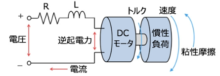

# システムの数学モデル

システムとしての制御対象は静的、動的の2つに大別できる。  
静的なシステムとはtにおける入力値のみで出力が決まるシステムで、バネがその一例である。  
動的なシステムとは入出力関係が変数の微分になるものである。  

## 物理モデル

## 電気モデル

## 直流モータモデル

回路部分  
$$ L_a \frac{di_a(t)}{dt} + R_a i_a(t) = b_a(t) - v_b(t) $$  
$$ v_a(t) $$ : 電圧  
$$ v_b(t) $$ : 逆起電力  
